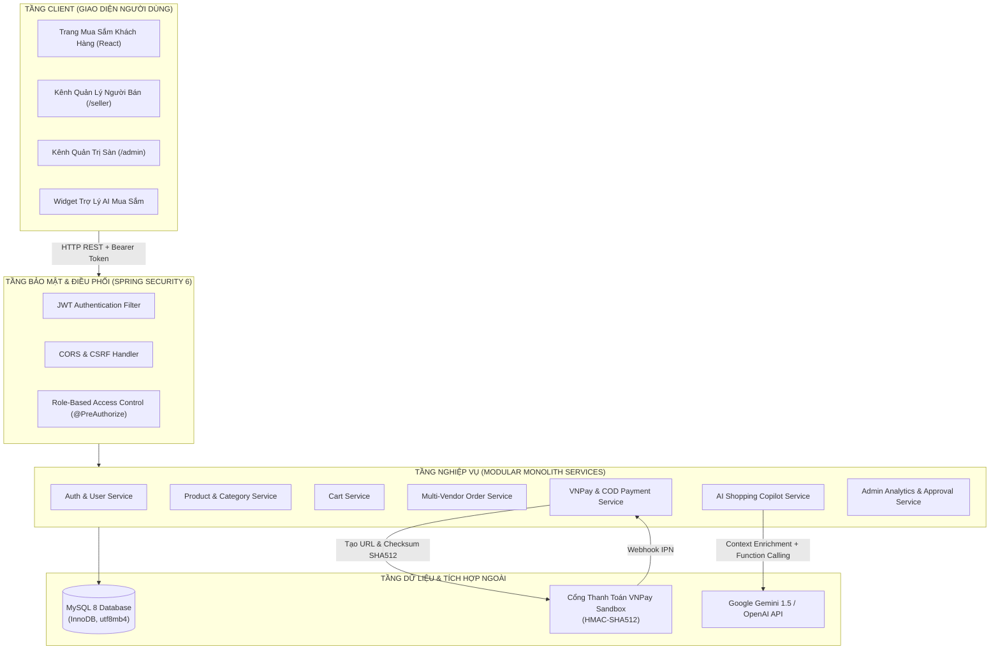
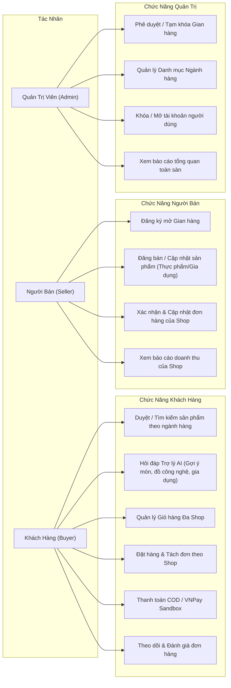
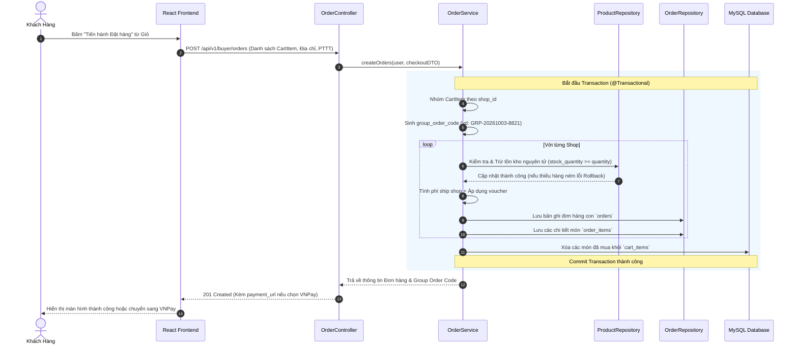
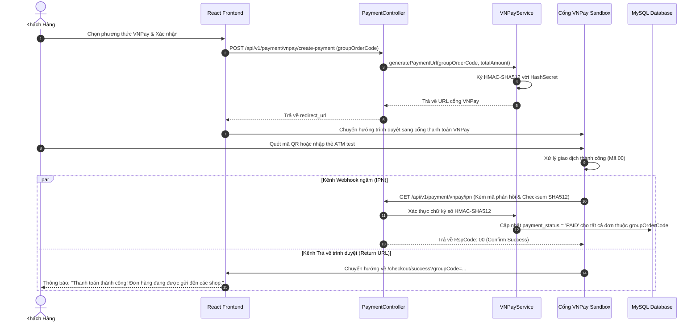
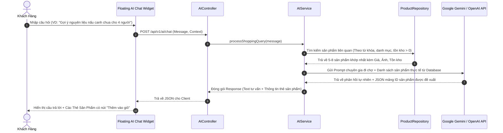
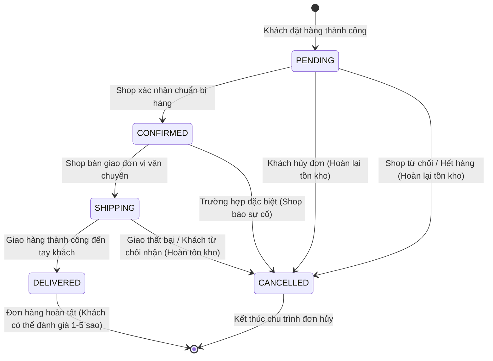

# 04. TỔNG HỢP CÁC SƠ ĐỒ HỆ THỐNG (SYSTEM DIAGRAMS)
## Architecture, Use Case, Sequence & State Diagrams

---

### 1. Sơ đồ Kiến trúc Tổng thể Hệ thống (System Architecture)

---

### 2. Sơ đồ Use Case Tổng thể (Use Case Diagram)

---

### 3. Sơ đồ Tuần tự: Tách Đơn Hàng Đa Shop (Multi-Vendor Order Splitting)

---

### 4. Sơ đồ Tuần tự: Thanh toán VNPay Sandbox & Webhook IPN

---

### 5. Sơ đồ Tuần tự: Trợ lý AI Mua sắm (AI Shopping Copilot)

---

### 6. Sơ đồ Vòng đời Trạng thái Đơn hàng (Order State Machine)

