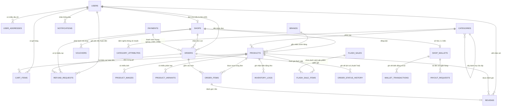

# 05. ĐẶC TẢ CƠ SỞ DỮ LIỆU & SƠ ĐỒ ERD (DATABASE SPECIFICATION)
## Enterprise Multi-Vendor Architecture, 24 Tables, 3-Tier Lifecycle, Soft Deletes & Financial Settlement

---

### 1. Sơ đồ Quan hệ Thực thể Toàn diện (Entity Relationship Diagram - ERD: 24 Bảng)

---

### 2. Kiến trúc Phân tầng Dữ liệu 3 Lớp (3-Tier Lifecycle Architecture)

| Tầng Dữ liệu | Vòng đời & Tần suất | Mục tiêu & Băng thông | Bảng & Dữ liệu Áp dụng | Công nghệ Lưu trữ |
| :--- | :--- | :--- | :--- | :--- |
| **🔥 Hot Tier (Tầng Nóng)** | 0 - 30 ngày Hàng triệu ops/giây | Tồn kho sống, đặt đơn, giỏ hàng, phiên đăng nhập, chốt đơn Flash Sale | `products.stock_quantity`, `product_variants.stock_quantity`, `cart_items`, `orders (PENDING, SHIPPING)`, `flash_sale_items` | In-Memory (Redis) + MySQL NVMe SSD |
| **🌤️ Warm Tier (Tầng Ấm)** | 1 - 12 tháng Hàng nghìn ops/phút | Lịch sử đơn thành công, đối soát người bán, đánh giá, thẻ kho gần đây | `orders (DELIVERED, CANCELLED)`, `order_status_history`, `reviews`, `wallet_transactions`, `inventory_logs (< 1 năm)` | MySQL Read-Replicas, Table Partitioning theo Tháng/Năm |
| **❄️ Cold Tier (Tầng Lạnh)** | > 1 năm Truy vấn định kỳ/hiếm | Kiểm toán thuế, sao kê dòng tiền pháp lý, lưu trữ nén vĩnh viễn | `orders (storage_tier = COLD)`, `order_items`, `inventory_logs (> 1 năm)`, `payments cũ` | Nén Parquet trên AWS S3 Glacier / MinIO / BigQuery / ClickHouse |

---

### 3. Nguyên tắc Bất biến & Xóa mềm Toàn diện (Soft Delete Policy)
* **Tuyệt đối cấm `DELETE FROM`** trên các bảng: `users`, `shops`, `categories`, `products`, `product_variants`, `vouchers`, `reviews`.
* Mọi bảng được trang bị cặp trường:
  * `is_deleted BOOLEAN NOT NULL DEFAULT FALSE`
  * `deleted_at DATETIME NULL`
* Khi một thực thể bị xóa:
  * Ứng dụng cập nhật `is_deleted = TRUE` và `deleted_at = NOW()`.
  * Các câu truy vấn mua bán, tìm kiếm tự động lọc: `WHERE is_deleted = FALSE`.
  * Khách hàng xem lại lịch sử đơn hàng cũ vẫn thấy trọn vẹn thông tin mặt hàng, không bao giờ bị lỗi `NullPointerException` hay gãy khóa ngoại.

---

### 4. Từ điển Dữ liệu Chi tiết (Enterprise Data Dictionary - 24 Bảng)

#### 4.1 Bảng `users` (Tài khoản người dùng toàn sàn)
| Cột | Kiểu dữ liệu | Null | Mặc định | Chú thích nghiệp vụ |
| :--- | :--- | :---: | :---: | :--- |
| `id` | BIGINT AUTO_INCREMENT | NO | PK | Định danh duy nhất người dùng |
| `username` | VARCHAR(50) | NO | UNIQUE | Tên đăng nhập |
| `email` | VARCHAR(100) | NO | UNIQUE | Email nhận thông báo và hóa đơn |
| `password_hash`| VARCHAR(255) | NO | | Mật khẩu băm BCrypt |
| `full_name` | VARCHAR(100) | NO | | Họ và tên hiển thị |
| `phone` | VARCHAR(20) | YES | NULL | SĐT liên hệ |
| `avatar_url` | VARCHAR(255) | YES | NULL | Ảnh đại diện |
| `role` | ENUM | NO | `ROLE_BUYER` | Vai trò: `ROLE_BUYER`, `ROLE_SELLER`, `ROLE_ADMIN` |
| `status` | ENUM | NO | `ACTIVE` | Trạng thái: `ACTIVE`, `BLOCKED` |
| `is_deleted` | BOOLEAN | NO | FALSE | Cờ xóa mềm tài khoản |
| `deleted_at` | DATETIME | YES | NULL | Thời điểm xóa mềm |
| `created_at` | DATETIME | NO | CURRENT_TIMESTAMP | Thời điểm tạo |
| `updated_at` | DATETIME | NO | CURRENT_TIMESTAMP | Thời điểm cập nhật cuối |

#### 4.2 Bảng `user_addresses` (Sổ địa chỉ nhận hàng)
| Cột | Kiểu dữ liệu | Null | Mặc định | Chú thích nghiệp vụ |
| :--- | :--- | :---: | :---: | :--- |
| `id` | BIGINT AUTO_INCREMENT | NO | PK | Định danh địa chỉ |
| `user_id` | BIGINT | NO | FK | Chủ sở hữu (`users.id`) |
| `receiver_name`| VARCHAR(100) | NO | | Tên người nhận hàng |
| `phone` | VARCHAR(20) | NO | | SĐT nhận hàng |
| `province` | VARCHAR(100) | NO | | Tỉnh / Thành phố |
| `district` | VARCHAR(100) | NO | | Quận / Huyện |
| `ward` | VARCHAR(100) | NO | | Phường / Xã |
| `detail_address`| VARCHAR(255)| NO | | Địa chỉ chi tiết |
| `is_default` | BOOLEAN | NO | FALSE | Địa chỉ mặc định |
| `created_at` | DATETIME | NO | CURRENT_TIMESTAMP | Ngày tạo |

#### 4.3 Bảng `shops` (Gian hàng người bán)
| Cột | Kiểu dữ liệu | Null | Mặc định | Chú thích nghiệp vụ |
| :--- | :--- | :---: | :---: | :--- |
| `id` | BIGINT AUTO_INCREMENT | NO | PK | Định danh gian hàng |
| `user_id` | BIGINT | NO | FK, UNIQUE | Tài khoản chủ shop (`users.id`) |
| `name` | VARCHAR(150) | NO | | Tên gian hàng |
| `slug` | VARCHAR(150) | NO | UNIQUE | Đường dẫn thân thiện SEO |
| `shop_type` | ENUM | NO | `GENERAL` | `GENERAL`, `FOOD_FRESH`, `OFFICIAL_MALL` |
| `logo_url` | VARCHAR(255) | YES | NULL | Logo |
| `banner_url` | VARCHAR(255) | YES | NULL | Ảnh bìa |
| `description` | TEXT | YES | NULL | Mô tả shop |
| `phone` | VARCHAR(20) | NO | | Hotline hỗ trợ |
| `address` | VARCHAR(255) | NO | | Địa chỉ kho/cửa hàng |
| `rating` | DECIMAL(2,1) | NO | 5.0 | Điểm sao shop (Trigger tự tính) |
| `status` | ENUM | NO | `APPROVED` | `PENDING`, `APPROVED`, `REJECTED`, `LOCKED` |
| `is_deleted` | BOOLEAN | NO | FALSE | Cờ xóa mềm gian hàng |
| `deleted_at` | DATETIME | YES | NULL | Thời điểm xóa mềm |
| `created_at` | DATETIME | NO | CURRENT_TIMESTAMP | Ngày tạo |
| `updated_at` | DATETIME | NO | CURRENT_TIMESTAMP | Cập nhật cuối |

#### 4.4 Bảng `brands` (Thương hiệu chính hãng)
| Cột | Kiểu dữ liệu | Null | Mặc định | Chú thích nghiệp vụ |
| :--- | :--- | :---: | :---: | :--- |
| `id` | BIGINT AUTO_INCREMENT | NO | PK | Định danh thương hiệu |
| `name` | VARCHAR(150) | NO | | Tên thương hiệu (Apple, Vinamilk, Philips...) |
| `slug` | VARCHAR(150) | NO | UNIQUE | Slug SEO |
| `logo_url` | VARCHAR(255) | YES | NULL | Logo thương hiệu |
| `description` | TEXT | YES | NULL | Giới thiệu |
| `is_active` | BOOLEAN | NO | TRUE | Trạng thái hiển thị |
| `created_at` | DATETIME | NO | CURRENT_TIMESTAMP | Ngày tạo |

#### 4.5 Bảng `categories` (Cây danh mục đa cấp)
| Cột | Kiểu dữ liệu | Null | Mặc định | Chú thích nghiệp vụ |
| :--- | :--- | :---: | :---: | :--- |
| `id` | BIGINT AUTO_INCREMENT | NO | PK | Định danh danh mục |
| `name` | VARCHAR(150) | NO | | Tên danh mục |
| `slug` | VARCHAR(150) | NO | UNIQUE | Đường dẫn SEO |
| `icon_url` | VARCHAR(255) | YES | NULL | Biểu tượng danh mục |
| `parent_id` | BIGINT | YES | NULL | Danh mục cha (NULL = Cấp gốc) |
| `display_order`| INT | NO | 0 | Thứ tự hiển thị menu |
| `is_deleted` | BOOLEAN | NO | FALSE | Cờ xóa mềm danh mục |
| `deleted_at` | DATETIME | YES | NULL | Thời điểm xóa mềm |
| `created_at` | DATETIME | NO | CURRENT_TIMESTAMP | Ngày tạo |

#### 4.6 Bảng `category_attributes` (Đặc tả thông số chuẩn theo danh mục)
| Cột | Kiểu dữ liệu | Null | Mặc định | Chú thích nghiệp vụ |
| :--- | :--- | :---: | :---: | :--- |
| `id` | BIGINT AUTO_INCREMENT | NO | PK | Định danh thuộc tính chuẩn |
| `category_id` | BIGINT | NO | FK | Thuộc danh mục nào (`categories.id`) |
| `attribute_name`| VARCHAR(100)| NO | | Tên thuộc tính (RAM, Dung lượng pin, Tiêu chuẩn VietGAP) |
| `attribute_type`| ENUM | NO | `TEXT` | `TEXT`, `SELECT`, `NUMBER`, `BOOLEAN` |
| `options_json`| TEXT | YES | NULL | Danh sách lựa chọn dạng JSON (vd: `["4GB", "8GB", "16GB"]`) |
| `is_required` | BOOLEAN | NO | FALSE | Bắt buộc nhập khi đăng bán hay không |
| `display_order`| INT | NO | 0 | Thứ tự trên bộ lọc tìm kiếm |

#### 4.7 Bảng `products` (Mặt hàng đa ngành & Chợ tươi sống)
| Cột | Kiểu dữ liệu | Null | Mặc định | Chú thích nghiệp vụ |
| :--- | :--- | :---: | :---: | :--- |
| `id` | BIGINT AUTO_INCREMENT | NO | PK | Định danh sản phẩm |
| `shop_id` | BIGINT | NO | FK | Gian hàng đăng bán (`shops.id`) |
| `category_id` | BIGINT | NO | FK | Ngành hàng ngọn (`categories.id`) |
| `brand_id` | BIGINT | YES | NULL | Thương hiệu (`brands.id`) |
| `name` | VARCHAR(255) | NO | | Tên sản phẩm |
| `slug` | VARCHAR(255) | NO | UNIQUE | Slug SEO |
| `description` | TEXT | YES | NULL | Mô tả chi tiết |
| `thumbnail_url`| VARCHAR(255) | NO | | Ảnh đại diện chính |
| `original_price`| DECIMAL(12,2)| NO | | Giá niêm yết gốc |
| `selling_price` | DECIMAL(12,2)| NO | | Giá bán thực tế |
| `stock_quantity`| DECIMAL(10,2)| NO | 0.00 | Tồn kho khả dụng (Hỗ trợ số lẻ kg) |
| `sold_quantity` | DECIMAL(10,2)| NO | 0.00 | Số lượng đã bán (Trigger tự tăng) |
| `unit` | VARCHAR(30) | NO | `chiếc` | Đơn vị: kg, g, bó, hộp, thùng, chiếc... |
| `has_variants` | BOOLEAN | NO | FALSE | Có phân loại Size/Màu hay không |
| `weight_grams` | INT | NO | 500 | Trọng lượng (Gram) để tính cước vận chuyển |
| `min_order_quantity`| DECIMAL(10,2)| NO | 1.00 | Số lượng mua tối thiểu |
| `step_quantity`| DECIMAL(10,2)| NO | 1.00 | Bước nhảy tăng/giảm |
| `storage_type` | ENUM | NO | `NORMAL` | `NORMAL`, `FRESH`, `FROZEN_CHILLED` |
| `shelf_life` | VARCHAR(100) | YES | NULL | Hạn sử dụng |
| `origin` | VARCHAR(150) | YES | NULL | Nguồn gốc xuất xứ |
| `attributes` | TEXT | YES | NULL | Thông số kỹ thuật / Chứng nhận dạng JSON |
| `rating_avg` | DECIMAL(2,1) | NO | 5.0 | Điểm sao trung bình (Trigger tự tính) |
| `review_count` | INT | NO | 0 | Số lượt nhận xét |
| `status` | ENUM | NO | `ACTIVE` | `ACTIVE`, `INACTIVE`, `OUT_OF_STOCK` |
| `is_deleted` | BOOLEAN | NO | FALSE | Cờ xóa mềm sản phẩm |
| `deleted_at` | DATETIME | YES | NULL | Thời điểm xóa mềm |
| `created_at` | DATETIME | NO | CURRENT_TIMESTAMP | Ngày tạo |
| `updated_at` | DATETIME | NO | CURRENT_TIMESTAMP | Ngày cập nhật |

#### 4.8 Bảng `product_images` (Thư viện hình ảnh sản phẩm)
| Cột | Kiểu dữ liệu | Null | Mặc định | Chú thích nghiệp vụ |
| :--- | :--- | :---: | :---: | :--- |
| `id` | BIGINT AUTO_INCREMENT | NO | PK | Định danh hình ảnh |
| `product_id` | BIGINT | NO | FK | Thuộc sản phẩm nào |
| `image_url` | VARCHAR(255) | NO | | URL ảnh chi tiết |
| `display_order`| INT | NO | 0 | Thứ tự hiển thị slider |

#### 4.9 Bảng `product_variants` (Phân loại biến thể: Size, Trọng lượng, Màu sắc)
| Cột | Kiểu dữ liệu | Null | Mặc định | Chú thích nghiệp vụ |
| :--- | :--- | :---: | :---: | :--- |
| `id` | BIGINT AUTO_INCREMENT | NO | PK | Định danh biến thể |
| `product_id` | BIGINT | NO | FK | Thuộc sản phẩm nào |
| `variant_name` | VARCHAR(100) | NO | | Tên biến thể (vd: "Túi 500g", "Size L - Đỏ") |
| `price` | DECIMAL(12,2) | NO | | Giá bán riêng của biến thể |
| `stock_quantity`| DECIMAL(10,2)| NO | 0.00 | Tồn kho riêng của biến thể |
| `is_deleted` | BOOLEAN | NO | FALSE | Cờ xóa mềm phân loại |

#### 4.10 Bảng `cart_items` (Giỏ hàng người mua)
| Cột | Kiểu dữ liệu | Null | Mặc định | Chú thích nghiệp vụ |
| :--- | :--- | :---: | :---: | :--- |
| `id` | BIGINT AUTO_INCREMENT | NO | PK | Định danh mục giỏ |
| `user_id` | BIGINT | NO | FK | Khách hàng sở hữu |
| `product_id` | BIGINT | NO | FK | Sản phẩm chọn mua |
| `variant_id` | BIGINT | YES | NULL | Biến thể (nếu có) |
| `quantity` | DECIMAL(10,2) | NO | 1.00 | Số lượng chọn mua |
| `created_at` | DATETIME | NO | CURRENT_TIMESTAMP | Thời điểm thêm vào giỏ |
| `updated_at` | DATETIME | NO | CURRENT_TIMESTAMP | Cập nhật số lượng |

#### 4.11 Bảng `orders` (Đơn hàng con phân tách theo từng Shop - Sẵn sàng phân tầng)
| Cột | Kiểu dữ liệu | Null | Mặc định | Chú thích nghiệp vụ |
| :--- | :--- | :---: | :---: | :--- |
| `id` | BIGINT AUTO_INCREMENT | NO | PK | Định danh đơn hàng |
| `order_code` | VARCHAR(50) | NO | UNIQUE | Mã đơn riêng: `ORD-20261007-XXXXXX` |
| `group_order_code`| VARCHAR(50)| NO | | Mã nhóm thanh toán chung giỏ hàng |
| `user_id` | BIGINT | NO | FK | Người mua |
| `shop_id` | BIGINT | NO | FK | Người bán (Phân tách Multi-Vendor tuyệt đối) |
| `shipping_name`| VARCHAR(100) | NO | | Tên người nhận |
| `shipping_phone`| VARCHAR(20) | NO | | SĐT nhận hàng |
| `shipping_address`| VARCHAR(255)| NO | | Địa chỉ giao hàng |
| `shipping_method`| ENUM | NO | `STANDARD` | `STANDARD`, `EXPRESS_FRESH` (Hỏa tốc tươi sống) |
| `total_amount` | DECIMAL(12,2)| NO | | Tổng tiền hàng ban đầu |
| `shipping_fee` | DECIMAL(12,2)| NO | 0.00 | Phí vận chuyển |
| `discount_amount`| DECIMAL(12,2)| NO | 0.00 | Tổng giảm giá |
| `shop_discount_amount`| DECIMAL(12,2)| NO | 0.00 | Giảm giá do Shop tự tài trợ |
| `platform_discount_amount`| DECIMAL(12,2)| NO | 0.00 | Giảm giá do Sàn Chopee tài trợ |
| `final_amount` | DECIMAL(12,2)| NO | | Số tiền người mua thanh toán thực tế |
| `payment_method`| ENUM | NO | `COD` | `COD`, `VNPAY` |
| `payment_status`| ENUM | NO | `UNPAID` | `UNPAID`, `PAID`, `FAILED`, `REFUNDED` |
| `status` | ENUM | NO | `PENDING` | `PENDING`, `CONFIRMED`, `SHIPPING`, `DELIVERED`, `CANCELLED` |
| `storage_tier` | ENUM | NO | `HOT` | **Tầng dữ liệu: `HOT`, `WARM`, `COLD`** |
| `note` | VARCHAR(255) | YES | NULL | Ghi chú của khách |
| `cancelled_by` | ENUM | YES | NULL | `BUYER`, `SELLER`, `ADMIN`, `SYSTEM` |
| `cancellation_reason`| VARCHAR(255)| YES | NULL | Lý do hủy đơn |
| `created_at` | DATETIME | NO | CURRENT_TIMESTAMP | Ngày tạo đơn |
| `updated_at` | DATETIME | NO | CURRENT_TIMESTAMP | Cập nhật trạng thái cuối |

#### 4.12 Bảng `order_items` (Chi tiết món hàng đã chốt trong đơn)
| Cột | Kiểu dữ liệu | Null | Mặc định | Chú thích nghiệp vụ |
| :--- | :--- | :---: | :---: | :--- |
| `id` | BIGINT AUTO_INCREMENT | NO | PK | Định danh món hàng |
| `order_id` | BIGINT | NO | FK | Thuộc đơn hàng nào |
| `product_id` | BIGINT | NO | FK | Sản phẩm gốc |
| `variant_id` | BIGINT | YES | NULL | Biến thể gốc |
| `product_name` | VARCHAR(255) | NO | | **Snapshot tên sản phẩm lúc chốt mua** |
| `variant_name` | VARCHAR(100) | YES | NULL | **Snapshot phân loại lúc chốt mua** |
| `unit` | VARCHAR(30) | NO | | Snapshot đơn vị tính |
| `product_price`| DECIMAL(12,2)| NO | | Snapshot đơn giá lúc mua |
| `quantity` | DECIMAL(10,2)| NO | | Số lượng đặt mua |
| `subtotal` | DECIMAL(12,2)| NO | | Thành tiền món |

#### 4.13 Bảng `order_status_history` (Nhật ký hành trình đơn hàng - Audit Trail)
| Cột | Kiểu dữ liệu | Null | Mặc định | Chú thích nghiệp vụ |
| :--- | :--- | :---: | :---: | :--- |
| `id` | BIGINT AUTO_INCREMENT | NO | PK | Định danh dòng nhật ký |
| `order_id` | BIGINT | NO | FK | Đơn hàng được theo vết |
| `previous_status`| VARCHAR(30)| YES | NULL | Trạng thái trước |
| `new_status` | VARCHAR(30) | NO | | Trạng thái mới |
| `changed_by` | VARCHAR(100) | YES | NULL | Tác nhân: BUYER, SELLER, ADMIN, SYSTEM |
| `note` | VARCHAR(255) | YES | NULL | Lý do / ghi chú |
| `created_at` | DATETIME | NO | CURRENT_TIMESTAMP | Thời điểm chuyển trạng thái |

#### 4.14 Bảng `payments` (Lịch sử thanh toán trực tuyến)
| Cột | Kiểu dữ liệu | Null | Mặc định | Chú thích nghiệp vụ |
| :--- | :--- | :---: | :---: | :--- |
| `id` | BIGINT AUTO_INCREMENT | NO | PK | Định danh giao dịch cổng thanh toán |
| `group_order_code`| VARCHAR(50)| NO | UNIQUE | Mã nhóm đơn hàng |
| `payment_method`| VARCHAR(30) | NO | `VNPAY` | Cổng thanh toán |
| `amount` | DECIMAL(12,2)| NO | | Số tiền thanh toán |
| `status` | ENUM | NO | `UNPAID` | `UNPAID`, `PAID`, `FAILED` |
| `transaction_reference`| VARCHAR(100)| YES | NULL | Mã đối soát từ VNPay/Ngân hàng |
| `bank_code` | VARCHAR(50) | YES | NULL | Mã ngân hàng giao dịch |
| `pay_date` | DATETIME | YES | NULL | Thời điểm thanh toán thành công |
| `created_at` | DATETIME | NO | CURRENT_TIMESTAMP | Ngày tạo |

#### 4.15 Bảng `vouchers` (Mã giảm giá toàn sàn & riêng từng shop)
| Cột | Kiểu dữ liệu | Null | Mặc định | Chú thích nghiệp vụ |
| :--- | :--- | :---: | :---: | :--- |
| `id` | BIGINT AUTO_INCREMENT | NO | PK | Định danh voucher |
| `shop_id` | BIGINT | YES | NULL | NULL = Mã Sàn, có ID = Mã Shop |
| `code` | VARCHAR(50) | NO | UNIQUE | Mã nhập (vd: `FREESHIP_MAX`) |
| `voucher_name` | VARCHAR(150) | NO | | Tên chương trình |
| `discount_type`| ENUM | NO | `PERCENT` | `PERCENT`, `FIXED_AMOUNT` |
| `discount_value`| DECIMAL(10,2)| NO | | Giá trị giảm |
| `min_order_value`| DECIMAL(12,2)| NO | 0.00 | Giá trị đơn tối thiểu áp dụng |
| `max_discount_amount`| DECIMAL(10,2)| YES | NULL | Giảm tối đa (nếu theo %) |
| `usage_limit` | INT | NO | 100 | Tổng lượt sử dụng toàn chương trình |
| `used_count` | INT | NO | 0 | Số lượt đã dùng |
| `start_date` | DATETIME | NO | | Thời điểm bắt đầu hiệu lực |
| `end_date` | DATETIME | NO | | Thời điểm hết hạn |
| `is_active` | BOOLEAN | NO | TRUE | Trạng thái kích hoạt |
| `is_deleted` | BOOLEAN | NO | FALSE | Cờ xóa mềm mã |
| `deleted_at` | DATETIME | YES | NULL | Thời điểm xóa mềm |
| `created_at` | DATETIME | NO | CURRENT_TIMESTAMP | Ngày tạo |

#### 4.16 Bảng `reviews` (Đánh giá sao & nhận xét trải nghiệm)
| Cột | Kiểu dữ liệu | Null | Mặc định | Chú thích nghiệp vụ |
| :--- | :--- | :---: | :---: | :--- |
| `id` | BIGINT AUTO_INCREMENT | NO | PK | Định danh đánh giá |
| `product_id` | BIGINT | NO | FK | Sản phẩm được đánh giá |
| `user_id` | BIGINT | NO | FK | Khách hàng đánh giá |
| `order_item_id`| BIGINT | NO | FK, UNIQUE | Ràng buộc: Mỗi món hàng chỉ đánh giá đúng 1 lần |
| `rating` | INT | NO | | 1 đến 5 sao |
| `comment` | TEXT | YES | NULL | Nhận xét chi tiết |
| `images_json` | TEXT | YES | NULL | Mảng URL ảnh thực tế mở hộp |
| `shop_reply` | TEXT | YES | NULL | Phản hồi của người bán |
| `is_deleted` | BOOLEAN | NO | FALSE | Cờ xóa mềm nhận xét |
| `deleted_at` | DATETIME | YES | NULL | Thời điểm xóa mềm |
| `created_at` | DATETIME | NO | CURRENT_TIMESTAMP | Ngày viết đánh giá |

#### 4.17 Bảng `shop_wallets` (Ví tiền người bán - Escrow Balance)
| Cột | Kiểu dữ liệu | Null | Mặc định | Chú thích nghiệp vụ |
| :--- | :--- | :---: | :---: | :--- |
| `id` | BIGINT AUTO_INCREMENT | NO | PK | Định danh ví |
| `shop_id` | BIGINT | NO | FK, UNIQUE | Gian hàng sở hữu ví |
| `available_balance`| DECIMAL(14,2)| NO | 0.00 | Số dư khả dụng (Đã đối soát xong, được quyền rút) |
| `pending_balance` | DECIMAL(14,2)| NO | 0.00 | Số dư chờ đối soát (Đơn đang giao hoặc đang chờ hết hạn đổi trả) |
| `locked_balance` | DECIMAL(14,2)| NO | 0.00 | Số dư bị đóng băng (Khi có tranh chấp hoặc nghi vấn gian lận) |
| `created_at` | DATETIME | NO | CURRENT_TIMESTAMP | Ngày mở ví |
| `updated_at` | DATETIME | NO | CURRENT_TIMESTAMP | Cập nhật số dư cuối |

#### 4.18 Bảng `wallet_transactions` (Lịch sử biến động ví tiền)
| Cột | Kiểu dữ liệu | Null | Mặc định | Chú thích nghiệp vụ |
| :--- | :--- | :---: | :---: | :--- |
| `id` | BIGINT AUTO_INCREMENT | NO | PK | Định danh giao dịch |
| `wallet_id` | BIGINT | NO | FK | Thuộc ví nào |
| `order_id` | BIGINT | YES | NULL | Liên kết đơn hàng phát sinh dòng tiền |
| `transaction_type`| ENUM | NO | | `ORDER_PAYOUT`, `COMMISSION_FEE`, `WITHDRAWAL`, `REFUND_DEDUCT`, `ADJUSTMENT` |
| `amount` | DECIMAL(14,2)| NO | | Số tiền biến động (Dương = Cộng vào, Âm = Trừ đi) |
| `balance_after` | DECIMAL(14,2)| NO | | Số dư ví ngay sau giao dịch |
| `description` | VARCHAR(255) | NO | | Diễn giải chi tiết biến động |
| `created_at` | DATETIME | NO | CURRENT_TIMESTAMP | Thời điểm giao dịch |

#### 4.19 Bảng `payout_requests` (Yêu cầu rút tiền về tài khoản ngân hàng)
| Cột | Kiểu dữ liệu | Null | Mặc định | Chú thích nghiệp vụ |
| :--- | :--- | :---: | :---: | :--- |
| `id` | BIGINT AUTO_INCREMENT | NO | PK | Định danh lệnh rút |
| `wallet_id` | BIGINT | NO | FK | Rút từ ví nào |
| `amount` | DECIMAL(14,2)| NO | | Số tiền người bán yêu cầu rút |
| `bank_name` | VARCHAR(100) | NO | | Tên ngân hàng thụ hưởng (Vietcombank, MBBank...) |
| `account_number`| VARCHAR(50) | NO | | Số tài khoản ngân hàng |
| `account_holder`| VARCHAR(100) | NO | | Tên chủ tài khoản ngân hàng |
| `status` | ENUM | NO | `PENDING` | `PENDING`, `APPROVED`, `REJECTED`, `TRANSFERRED` |
| `admin_note` | VARCHAR(255) | YES | NULL | Ghi chú của kế toán sàn |
| `created_at` | DATETIME | NO | CURRENT_TIMESTAMP | Ngày tạo yêu cầu |
| `updated_at` | DATETIME | NO | CURRENT_TIMESTAMP | Ngày duyệt/chuyển khoản |

#### 4.20 Bảng `refund_requests` (Yêu cầu trả hàng & hoàn tiền - Tranh chấp)
| Cột | Kiểu dữ liệu | Null | Mặc định | Chú thích nghiệp vụ |
| :--- | :--- | :---: | :---: | :--- |
| `id` | BIGINT AUTO_INCREMENT | NO | PK | Định danh khiếu nại |
| `order_id` | BIGINT | NO | FK | Đơn hàng bị khiếu nại |
| `user_id` | BIGINT | NO | FK | Người mua yêu cầu |
| `shop_id` | BIGINT | NO | FK | Shop bị yêu cầu hoàn tiền |
| `reason` | ENUM | NO | | `DAMAGED_GOODS`, `EXPIRED_FOOD`, `WRONG_ITEM`, `NOT_RECEIVED`, `OTHER` |
| `description` | TEXT | NO | | Chi tiết mô tả lỗi của kiện hàng |
| `evidence_images_json`| TEXT| YES | NULL | Ảnh/Video quay cận cảnh mở hộp làm bằng chứng |
| `refund_amount` | DECIMAL(12,2)| NO | | Số tiền đề xuất hoàn lại |
| `status` | ENUM | NO | `PENDING_SHOP`| `PENDING_SHOP`, `SHOP_REJECTED`, `ADMIN_MEDIATION`, `APPROVED`, `REFUNDED`, `CANCELLED` |
| `shop_response` | TEXT | YES | NULL | Ý kiến phản hồi của Shop |
| `admin_note` | TEXT | YES | NULL | Phán quyết của Sàn Chopee khi hòa giải |
| `created_at` | DATETIME | NO | CURRENT_TIMESTAMP | Ngày nộp yêu cầu |
| `updated_at` | DATETIME | NO | CURRENT_TIMESTAMP | Cập nhật tiến độ |

#### 4.21 Bảng `inventory_logs` (Thẻ kho - Nhật ký kiểm kê biến động xuất nhập tồn)
| Cột | Kiểu dữ liệu | Null | Mặc định | Chú thích nghiệp vụ |
| :--- | :--- | :---: | :---: | :--- |
| `id` | BIGINT AUTO_INCREMENT | NO | PK | Định danh bản ghi thẻ kho |
| `product_id` | BIGINT | NO | FK | Sản phẩm biến động |
| `variant_id` | BIGINT | YES | NULL | Biến thể (nếu có) |
| `change_type` | ENUM | NO | | `IMPORT`, `ORDER_SALE`, `ORDER_CANCEL_RESTOCK`, `RETURN_RESTOCK`, `DAMAGE_LOSS`, `MANUAL_CORRECTION` |
| `quantity_before`| DECIMAL(10,2)| NO | | Số lượng tồn kho trước biến động |
| `quantity_change`| DECIMAL(10,2)| NO | | Số lượng thay đổi (Âm = Xuất bán/Hao hụt; Dương = Nhập/Hoàn kho) |
| `quantity_after` | DECIMAL(10,2)| NO | | Số lượng tồn kho sau biến động |
| `reference_id` | VARCHAR(50) | YES | NULL | Mã đơn hàng hoặc mã phiếu nhập |
| `note` | VARCHAR(255) | YES | NULL | Ghi chú lý do biến động |
| `created_at` | DATETIME | NO | CURRENT_TIMESTAMP | Thời điểm ghi nhận |

#### 4.22 Bảng `notifications` (Hệ thống thông báo toàn sàn)
| Cột | Kiểu dữ liệu | Null | Mặc định | Chú thích nghiệp vụ |
| :--- | :--- | :---: | :---: | :--- |
| `id` | BIGINT AUTO_INCREMENT | NO | PK | Định danh thông báo |
| `user_id` | BIGINT | NO | FK | Người nhận thông báo |
| `title` | VARCHAR(200) | NO | | Tiêu đề thông báo |
| `content` | TEXT | NO | | Nội dung chi tiết |
| `notification_type`| ENUM | NO | `ORDER` | `ORDER`, `PROMOTION`, `WALLET`, `SYSTEM` |
| `reference_id` | VARCHAR(100) | YES | NULL | Mã liên kết điều hướng (vd: mã đơn ORD-...) |
| `is_read` | BOOLEAN | NO | FALSE | Cờ đã đọc |
| `created_at` | DATETIME | NO | CURRENT_TIMESTAMP | Thời điểm gửi |

#### 4.23 Bảng `flash_sales` (Chiến dịch khuyến mãi giờ vàng)
| Cột | Kiểu dữ liệu | Null | Mặc định | Chú thích nghiệp vụ |
| :--- | :--- | :---: | :---: | :--- |
| `id` | BIGINT AUTO_INCREMENT | NO | PK | Định danh đợt flash sale |
| `name` | VARCHAR(150) | NO | | Tên chiến dịch (vd: "Flash Sale Trưa 12h") |
| `start_time` | DATETIME | NO | | Bắt đầu khung giờ vàng |
| `end_time` | DATETIME | NO | | Kết thúc khung giờ vàng |
| `status` | ENUM | NO | `UPCOMING` | `UPCOMING`, `ACTIVE`, `ENDED` |
| `created_at` | DATETIME | NO | CURRENT_TIMESTAMP | Ngày tạo chiến dịch |

#### 4.24 Bảng `flash_sale_items` (Chi tiết phân bổ hạn ngạch giá sốc)
| Cột | Kiểu dữ liệu | Null | Mặc định | Chú thích nghiệp vụ |
| :--- | :--- | :---: | :---: | :--- |
| `id` | BIGINT AUTO_INCREMENT | NO | PK | Định danh mặt hàng tham gia sale |
| `flash_sale_id` | BIGINT | NO | FK | Thuộc chiến dịch Flash Sale nào |
| `product_id` | BIGINT | NO | FK | Sản phẩm tham gia |
| `variant_id` | BIGINT | YES | NULL | Biến thể tham gia (nếu có) |
| `flash_sale_price`| DECIMAL(12,2)| NO | | Giá khuyến mãi đặc biệt trong khung giờ |
| `stock_limit` | DECIMAL(10,2)| NO | | Giới hạn số lượng suất bán giá sốc |
| `sold_count` | DECIMAL(10,2)| NO | 0.00 | Số suất đã bán trong khung giờ |
| `sort_order` | INT | NO | 0 | Thứ tự ưu tiên trên trang chủ |

---

### 5. Danh mục Triggers, Stored Procedures & Stored Functions

#### 5.1 Triggers (Tự động hóa toàn vẹn dữ liệu)
1. `trg_prevent_negative_stock`: Chặn tuyệt đối số âm trên `products.stock_quantity`.
2. `trg_prevent_negative_variant_stock`: Chặn tuyệt đối số âm trên `product_variants.stock_quantity`.
3. `trg_order_status_audit`: Tự động chèn dòng lịch sử vào `order_status_history` mỗi khi đơn đổi trạng thái.
4. `trg_update_sold_count`: Tự động tăng `products.sold_quantity` và tự động ghi bản ghi xuất kho vào `inventory_logs`.
5. `trg_after_review_insert`: Tự động tính toán lại điểm sao sản phẩm `products.rating_avg` và uy tín toàn shop `shops.rating`.

#### 5.2 Stored Procedures (Xử lý nghiệp vụ nặng)
1. `sp_cancel_order_and_restock`: Hủy đơn, hoàn trả tồn kho sản phẩm + biến thể, ghi thẻ kho `inventory_logs`, đổi trạng thái đơn trong 1 Transaction nguyên tử duy nhất.
2. `sp_settle_order_payout`: Tự động đối soát và giải phóng tiền ký quỹ Escrow vào `shop_wallets` của người bán khi đơn hàng `DELIVERED`, trừ phí hoa hồng sàn và ghi vết `wallet_transactions`.
3. `sp_recalculate_shop_rating`: Batch job quét và tính lại điểm sao trung bình toàn bộ các shop định kỳ.
4. `sp_archive_cold_orders`: Batch job chuyển đổi trạng thái các đơn hàng cũ đã hoàn tất trên 365 ngày sang `storage_tier = 'COLD'`.

#### 5.3 Stored Functions (Tính toán dùng chung)
1. `fn_generate_order_code`: Sinh mã đơn ngẫu nhiên theo chuẩn `ORD-YYYYMMDD-XXXXXX`.
2. `fn_calculate_shipping_fee`: Tính cước vận chuyển chuẩn hóa theo phương thức giao hàng và khối lượng hàng (Gram).
