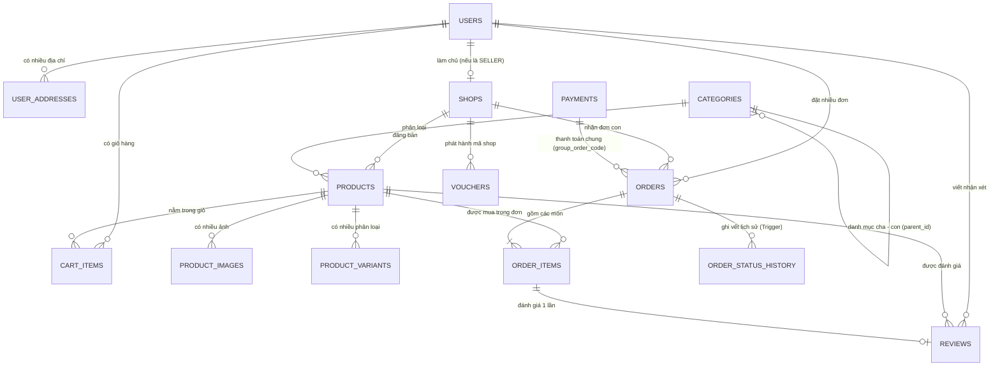

# 05. ĐẶC TẢ CƠ SỞ DỮ LIỆU & SƠ ĐỒ ERD (DATABASE SPECIFICATION)
## Database Schema, Data Dictionary, Triggers & Procedural Logic

---

### 1. Sơ đồ Quan hệ Thực thể Toàn diện (Entity Relationship Diagram - ERD)

---

### 2. Từ điển Dữ liệu Chi tiết (Data Dictionary - 14 Bảng)

#### 2.1 Bảng `users` (Tài khoản người dùng toàn sàn)
| Tên cột | Kiểu dữ liệu | Nullable | Mặc định | Ý nghĩa & Mô tả |
| :--- | :--- | :---: | :---: | :--- |
| `id` | BIGINT AUTO_INCREMENT | NO | PK | Định danh duy nhất người dùng |
| `username` | VARCHAR(50) | NO | UNIQUE | Tên đăng nhập |
| `email` | VARCHAR(100) | NO | UNIQUE | Địa chỉ email liên hệ & nhận thông báo |
| `password_hash` | VARCHAR(255) | NO | | Mật khẩu mã hóa BCrypt |
| `full_name` | VARCHAR(100) | NO | | Họ và tên hiển thị |
| `phone` | VARCHAR(20) | YES | NULL | Số điện thoại di động |
| `avatar_url` | VARCHAR(255) | YES | NULL | Đường dẫn ảnh đại diện |
| `role` | ENUM | NO | `ROLE_BUYER` | Vai trò: `ROLE_BUYER`, `ROLE_SELLER`, `ROLE_ADMIN` |
| `status` | ENUM | NO | `ACTIVE` | Trạng thái: `ACTIVE` (Hoạt động), `BLOCKED` (Bị khóa) |
| `created_at` | TIMESTAMP | NO | CURRENT_TIMESTAMP | Ngày giờ khởi tạo tài khoản |
| `updated_at` | TIMESTAMP | NO | CURRENT_TIMESTAMP | Ngày giờ cập nhật cuối |

#### 2.2 Bảng `user_addresses` (Sổ địa chỉ nhận hàng)
| Tên cột | Kiểu dữ liệu | Nullable | Mặc định | Ý nghĩa & Mô tả |
| :--- | :--- | :---: | :---: | :--- |
| `id` | BIGINT AUTO_INCREMENT | NO | PK | Định danh địa chỉ |
| `user_id` | BIGINT | NO | FK | Thuộc tài khoản nào (`users.id`) |
| `receiver_name` | VARCHAR(100) | NO | | Tên người nhận hàng |
| `phone` | VARCHAR(20) | NO | | SĐT liên hệ nhận hàng |
| `province` | VARCHAR(100) | NO | | Tỉnh / Thành phố |
| `district` | VARCHAR(100) | NO | | Quận / Huyện |
| `ward` | VARCHAR(100) | NO | | Phường / Xã |
| `detail_address`| VARCHAR(255) | NO | | Số nhà, ngõ ngách, tên đường |
| `is_default` | BOOLEAN | NO | FALSE | Địa chỉ mặc định lúc checkout |

#### 2.3 Bảng `shops` (Gian hàng / Người bán trên chợ)
| Tên cột | Kiểu dữ liệu | Nullable | Mặc định | Ý nghĩa & Mô tả |
| :--- | :--- | :---: | :---: | :--- |
| `id` | BIGINT AUTO_INCREMENT | NO | PK | Định danh gian hàng |
| `user_id` | BIGINT | NO | FK, UNIQUE | Chủ sở hữu shop (`users.id`, quan hệ 1-1) |
| `name` | VARCHAR(150) | NO | | Tên hiển thị của cửa hàng (VD: Nông Sản Đà Lạt) |
| `slug` | VARCHAR(150) | NO | UNIQUE | Đường dẫn thân thiện SEO (vd: `nong-san-da-lat`) |
| `shop_type` | ENUM | NO | `GENERAL` | Loại hình: `FOOD_FRESH`, `GENERAL`, `OFFICIAL_MALL` |
| `logo_url` | VARCHAR(255) | YES | NULL | Ảnh logo shop |
| `banner_url` | VARCHAR(255) | YES | NULL | Ảnh bìa gian hàng |
| `description` | TEXT | YES | NULL | Giới thiệu gian hàng |
| `phone` | VARCHAR(20) | NO | | Số hotline hỗ trợ của shop |
| `address` | VARCHAR(255) | NO | | Địa chỉ kho / cửa hàng của người bán |
| `rating` | DECIMAL(2,1) | NO | 5.0 | Điểm đánh giá uy tín (Trigger tự tính từ `reviews`) |
| `status` | ENUM | NO | `APPROVED` | `PENDING` (Chờ duyệt), `APPROVED` (Đang bán), `LOCKED` (Khóa) |

#### 2.4 Bảng `categories` (Cây Danh mục Đa Cấp: Gốc ➔ Nhánh ➔ Ngọn)
| Tên cột | Kiểu dữ liệu | Nullable | Mặc định | Ý nghĩa & Mô tả |
| :--- | :--- | :---: | :---: | :--- |
| `id` | BIGINT AUTO_INCREMENT | NO | PK | Định danh danh mục |
| `name` | VARCHAR(150) | NO | | Tên danh mục (VD: Công nghệ, Điện thoại...) |
| `slug` | VARCHAR(150) | NO | UNIQUE | Đường dẫn SEO |
| `icon_url` | VARCHAR(255) | YES | NULL | Icon đại diện trên thanh menu |
| `parent_id` | BIGINT | YES | NULL | **Trỏ về chính `categories.id` cha. NULL = Danh mục gốc** |
| `display_order` | INT | NO | 0 | Thứ tự hiển thị |

#### 2.5 Bảng `products` (Mặt hàng đa ngành & Chợ tươi sống - "Gọn từ gốc")
| Tên cột | Kiểu dữ liệu | Nullable | Mặc định | Ý nghĩa & Mô tả |
| :--- | :--- | :---: | :---: | :--- |
| `id` | BIGINT AUTO_INCREMENT | NO | PK | Định danh sản phẩm |
| `shop_id` | BIGINT | NO | FK | Thuộc gian hàng nào (`shops.id`) |
| `category_id` | BIGINT | NO | FK | Thuộc danh mục ngọn nào (`categories.id`) |
| `name` | VARCHAR(255) | NO | | Tên mặt hàng (VD: Cà chua beef, Nồi chiên Philips) |
| `slug` | VARCHAR(255) | NO | UNIQUE | Slug URL thân thiện SEO |
| `description` | TEXT | YES | NULL | Mô tả chi tiết sản phẩm |
| `thumbnail_url` | VARCHAR(255) | NO | | Ảnh đại diện chính |
| `original_price`| DECIMAL(12,2) | NO | | Giá gốc (hiển thị gạch ngang) |
| `selling_price` | DECIMAL(12,2) | NO | | Giá bán thực tế hiện tại |
| `stock_quantity`| DECIMAL(10,2) | NO | 0.00 | Số lượng tồn kho (Hỗ trợ số lẻ như `25.5` kg) |
| `sold_quantity` | DECIMAL(10,2) | NO | 0.00 | Số lượng đã bán (Trigger tự tăng khi chốt đơn) |
| `unit` | VARCHAR(30) | NO | `chiếc` | Đơn vị: `kg`, `g`, `bó`, `khay`, `lon`, `thùng`, `chiếc` |
| `has_variants` | BOOLEAN | NO | FALSE | Có phân loại biến thể (Size/Màu) hay không |
| `weight_grams` | INT | NO | 500 | Trọng lượng (Gram) để tính phí ship tự động |
| `min_order_quantity` | DECIMAL(10,2)| NO | 1.00 | Số lượng mua tối thiểu (vd: mua rau tối thiểu 0.5kg) |
| `step_quantity` | DECIMAL(10,2) | NO | 1.00 | Bước nhảy khi bấm tăng/giảm số lượng |
| `storage_type` | ENUM | NO | `NORMAL` | Bảo quản: `NORMAL`, `FRESH`, `FROZEN_CHILLED` |
| `shelf_life` | VARCHAR(100) | YES | NULL | Hạn sử dụng (VD: "3 ngày sau thu hoạch", "HSD: 12 tháng") |
| `origin` | VARCHAR(150) | YES | NULL | Nguồn gốc xuất xứ (VD: "Đà Lạt, Lâm Đồng", "Chính hãng Philips") |
| `attributes` | JSON | YES | NULL | **Thông số kỹ thuật / Đặc tả động theo từng loại mặt hàng** |
| `rating_avg` | DECIMAL(2,1) | NO | 5.0 | Điểm sao trung bình (Trigger tự cập nhật) |
| `review_count` | INT | NO | 0 | Tổng số lượt nhận xét |
| `status` | ENUM | NO | `ACTIVE` | Trạng thái: `ACTIVE` (Đang bán), `INACTIVE` (Ẩn), `OUT_OF_STOCK` (Hết hàng) |

#### 2.6 Bảng `product_images` (Thư viện hình ảnh sản phẩm)
| Tên cột | Kiểu dữ liệu | Nullable | Mặc định | Ý nghĩa & Mô tả |
| :--- | :--- | :---: | :---: | :--- |
| `id` | BIGINT AUTO_INCREMENT | NO | PK | Định danh ảnh |
| `product_id` | BIGINT | NO | FK | Thuộc sản phẩm nào (`products.id`) |
| `image_url` | VARCHAR(255) | NO | | Đường dẫn ảnh CDN/Cloud |
| `display_order` | INT | NO | 0 | Thứ tự trình chiếu trong slide gallery |

#### 2.7 Bảng `product_variants` (Biến thể phân loại: Size, Trọng lượng gói, Màu sắc)
| Tên cột | Kiểu dữ liệu | Nullable | Mặc định | Ý nghĩa & Mô tả |
| :--- | :--- | :---: | :---: | :--- |
| `id` | BIGINT AUTO_INCREMENT | NO | PK | Định danh biến thể |
| `product_id` | BIGINT | NO | FK | Thuộc sản phẩm nào (`products.id`) |
| `variant_name` | VARCHAR(100) | NO | | Tên biến thể (VD: "Túi 500g", "Túi 1kg", "Size M - Đen") |
| `price` | DECIMAL(12,2) | NO | | Giá bán riêng của biến thể |
| `stock_quantity`| DECIMAL(10,2) | NO | 0.00 | Tồn kho riêng của biến thể |

#### 2.8 Bảng `cart_items` (Giỏ hàng người mua)
| Tên cột | Kiểu dữ liệu | Nullable | Mặc định | Ý nghĩa & Mô tả |
| :--- | :--- | :---: | :---: | :--- |
| `id` | BIGINT AUTO_INCREMENT | NO | PK | Định danh dòng giỏ hàng |
| `user_id` | BIGINT | NO | FK | Khách hàng sở hữu (`users.id`) |
| `product_id` | BIGINT | NO | FK | Mặt hàng được chọn (`products.id`) |
| `variant_id` | BIGINT | YES | NULL | Biến thể được chọn (nếu có) |
| `quantity` | DECIMAL(10,2) | NO | 1.00 | Số lượng chọn mua (hỗ trợ số lẻ `0.5kg`) |

#### 2.9 Bảng `orders` (Đơn hàng con phân tách theo từng Shop - Đảm bảo Multi-Vendor)
| Tên cột | Kiểu dữ liệu | Nullable | Mặc định | Ý nghĩa & Mô tả |
| :--- | :--- | :---: | :---: | :--- |
| `id` | BIGINT AUTO_INCREMENT | NO | PK | Định danh đơn hàng con |
| `order_code` | VARCHAR(50) | NO | UNIQUE | Mã đơn con duy nhất (VD: `ORD-20261007-829142`) |
| `group_order_code`| VARCHAR(50) | NO | | **Mã giao dịch chung gom các shop lúc checkout** |
| `user_id` | BIGINT | NO | FK | Người mua hàng (`users.id`) |
| `shop_id` | BIGINT | NO | FK | Gian hàng thụ hưởng (`shops.id`) |
| `total_amount` | DECIMAL(12,2) | NO | | Tổng tiền hàng của riêng shop này |
| `shipping_fee` | DECIMAL(12,2) | NO | 0.00 | Phí vận chuyển riêng của shop |
| `discount_amount` | DECIMAL(12,2)| NO | 0.00 | Tổng tiền giảm giá áp dụng cho đơn |
| `shop_discount_amount` | DECIMAL(12,2)| NO | 0.00 | Tiền giảm do Shop tự chịu (Voucher của shop) |
| `platform_discount_amount`| DECIMAL(12,2)| NO | 0.00 | Tiền giảm do Sàn trợ giá (Sàn hoàn tiền cho shop) |
| `final_amount` | DECIMAL(12,2) | NO | | Số tiền thực trả (`total + ship - discount`) |
| `status` | ENUM | NO | `PENDING` | `PENDING`, `CONFIRMED`, `SHIPPING`, `DELIVERED`, `CANCELLED` |
| `payment_method` | ENUM | NO | `COD` | Hình thức: `COD` hoặc `VNPAY` |
| `payment_status` | ENUM | NO | `UNPAID` | `UNPAID`, `PAID`, `FAILED`, `REFUNDED` |
| `shipping_method` | ENUM | NO | `STANDARD`| `STANDARD` (Thường) hoặc `EXPRESS_FRESH` (Hỏa tốc thực phẩm) |
| `shipping_name` | VARCHAR(100) | NO | | Tên người nhận |
| `shipping_phone` | VARCHAR(20) | NO | | Số điện thoại nhận hàng |
| `shipping_address`| VARCHAR(255) | NO | | Địa chỉ giao hàng chi tiết |
| `note` | VARCHAR(255) | YES | NULL | Ghi chú từ khách hàng |
| `cancelled_by` | ENUM | YES | NULL | Người hủy: `BUYER`, `SELLER`, `ADMIN`, `SYSTEM` |
| `cancellation_reason` | VARCHAR(255) | YES | NULL | Lý do hủy đơn hàng |

#### 2.10 Bảng `order_items` (Chi tiết các mặt hàng trong đơn)
| Tên cột | Kiểu dữ liệu | Nullable | Mặc định | Ý nghĩa & Mô tả |
| :--- | :--- | :---: | :---: | :--- |
| `id` | BIGINT AUTO_INCREMENT | NO | PK | Định danh chi tiết đơn |
| `order_id` | BIGINT | NO | FK | Thuộc đơn hàng con nào (`orders.id`) |
| `product_id` | BIGINT | NO | FK | Sản phẩm được mua (`products.id`) |
| `variant_id` | BIGINT | YES | NULL | Biến thể (nếu có) |
| `product_name` | VARCHAR(255) | NO | | Tên sản phẩm chốt tại thời điểm mua |
| `variant_name` | VARCHAR(100) | YES | NULL | Tên phân loại chốt tại thời điểm mua |
| `unit` | VARCHAR(30) | NO | | Đơn vị tính (`kg`, `chiếc`) |
| `product_price` | DECIMAL(12,2) | NO | | Đơn giá lúc mua |
| `quantity` | DECIMAL(10,2) | NO | | Số lượng mua |
| `subtotal` | DECIMAL(12,2) | NO | | Thành tiền (`price * quantity`) |

#### 2.11 Bảng `order_status_history` (Nhật ký hành trình đơn hàng - Audit Trail)
| Tên cột | Kiểu dữ liệu | Nullable | Mặc định | Ý nghĩa & Mô tả |
| :--- | :--- | :---: | :---: | :--- |
| `id` | BIGINT AUTO_INCREMENT | NO | PK | Định danh bản ghi lịch sử |
| `order_id` | BIGINT | NO | FK | Đơn hàng nào (`orders.id`) |
| `previous_status` | VARCHAR(30) | YES | NULL | Trạng thái trước khi chuyển đổi |
| `new_status` | VARCHAR(30) | NO | | Trạng thái mới vừa chuyển sang |
| `changed_by` | VARCHAR(100) | YES | NULL | Người/Hệ thống thực hiện chuyển đổi |
| `note` | VARCHAR(255) | YES | NULL | Ghi chú nguyên nhân chuyển trạng thái |
| `created_at` | TIMESTAMP | NO | CURRENT_TIMESTAMP | Thời điểm diễn ra sự kiện |

#### 2.12 Bảng `payments` (Lịch sử giao dịch thanh toán VNPay)
| Tên cột | Kiểu dữ liệu | Nullable | Mặc định | Ý nghĩa & Mô tả |
| :--- | :--- | :---: | :---: | :--- |
| `id` | BIGINT AUTO_INCREMENT | NO | PK | Định danh giao dịch |
| `group_order_code`| VARCHAR(50) | NO | UNIQUE | Khớp với mã giao dịch chung của các đơn con |
| `payment_method` | VARCHAR(30) | NO | `VNPAY` | Cổng thanh toán |
| `amount` | DECIMAL(12,2) | NO | | Tổng tiền thanh toán toàn bộ giỏ hàng |
| `status` | ENUM | NO | `UNPAID` | `UNPAID`, `PAID`, `FAILED` |
| `transaction_reference`| VARCHAR(100)| YES | NULL | Mã giao dịch ngân hàng / VNPay trả về |
| `bank_code` | VARCHAR(50) | YES | NULL | Mã ngân hàng giao dịch |
| `pay_date` | DATETIME | YES | NULL | Thời điểm thanh toán thành công |

#### 2.13 Bảng `vouchers` (Mã khuyến mãi toàn sàn & riêng từng shop)
| Tên cột | Kiểu dữ liệu | Nullable | Mặc định | Ý nghĩa & Mô tả |
| :--- | :--- | :---: | :---: | :--- |
| `id` | BIGINT AUTO_INCREMENT | NO | PK | Định danh voucher |
| `shop_id` | BIGINT | YES | NULL | **NULL = Voucher toàn sàn; Có ID = Voucher của shop** |
| `code` | VARCHAR(50) | NO | UNIQUE | Mã giảm giá (VD: `CHOPEE10`, `FREESHIP50`) |
| `voucher_name` | VARCHAR(150) | NO | | Tên chương trình ưu đãi |
| `discount_type` | ENUM | NO | `PERCENT` | `PERCENT` (%) hoặc `FIXED_AMOUNT` (tiền mặt) |
| `discount_value`| DECIMAL(10,2) | NO | | Giá trị giảm |
| `min_order_value`| DECIMAL(12,2) | NO | 0.00 | Giá trị đơn hàng tối thiểu |
| `max_discount_amount`| DECIMAL(10,2)| YES | NULL | Mức giảm tối đa (nếu là %) |
| `usage_limit` | INT | NO | 100 | Số lượt dùng tối đa |
| `used_count` | INT | NO | 0 | Số lượt đã sử dụng |
| `start_date` | DATETIME | NO | | Ngày bắt đầu hiệu lực |
| `end_date` | DATETIME | NO | | Ngày hết hạn |
| `is_active` | BOOLEAN | NO | TRUE | Trạng thái kích hoạt |

#### 2.14 Bảng `reviews` (Đánh giá sao & Nhận xét kèm ảnh thực tế)
| Tên cột | Kiểu dữ liệu | Nullable | Mặc định | Ý nghĩa & Mô tả |
| :--- | :--- | :---: | :---: | :--- |
| `id` | BIGINT AUTO_INCREMENT | NO | PK | Định danh đánh giá |
| `product_id` | BIGINT | NO | FK | Đánh giá sản phẩm nào (`products.id`) |
| `user_id` | BIGINT | NO | FK | Người viết đánh giá (`users.id`) |
| `order_item_id` | BIGINT | NO | FK, UNIQUE | **Mỗi món hàng đã mua chỉ được đánh giá 1 lần duy nhất** |
| `rating` | INT | NO | 5 | Điểm sao (Từ 1 đến 5 sao) |
| `comment` | TEXT | YES | NULL | Nhận xét chi tiết |
| `images_json` | TEXT | YES | NULL | Mảng JSON link ảnh thực tế: `["img1.jpg", "img2.jpg"]` |
| `shop_reply` | TEXT | YES | NULL | Phản hồi của người bán |

---

### 3. Các Đối Tượng Xử Lý Nâng Cao Tầng Database

#### 3.1 Triggers (Bộ kích hoạt tự động)
1. **`trg_prevent_negative_stock` (BEFORE UPDATE on `products`):** Chống âm kho tuyệt đối, phát `SIGNAL SQLSTATE '45000'` nếu `stock_quantity < 0`.
2. **`trg_order_status_audit` (AFTER UPDATE on `orders`):** Tự động ghi chép vết thay đổi trạng thái đơn vào `order_status_history`.
3. **`trg_update_sold_count` (AFTER INSERT on `order_items`):** Tự động cộng dồn số lượng đã bán `products.sold_quantity`.
4. **`trg_after_review_insert` (AFTER INSERT on `reviews`):** Tự động tính lại điểm trung bình sao cho sản phẩm và toàn bộ gian hàng.

#### 3.2 Stored Procedures & Functions
1. **`sp_cancel_order_and_restock`:** Thủ tục hoàn trả tồn kho và đổi trạng thái đơn hàng bị hủy trong 1 Transaction an toàn.
2. **`sp_recalculate_shop_rating`:** Thủ tục quét lại toàn bộ điểm uy tín của Shop khi cần đồng bộ.
3. **`fn_generate_order_code()`:** Hàm sinh mã đơn hàng chuẩn định dạng `ORD-YYYYMMDD-XXXX`.
4. **`fn_calculate_shipping_fee(shipping_method, weight_grams)`:** Hàm tính cước phí giao hàng dựa trên trọng lượng hàng và hình thức hỏa tốc.

---

### 4. Chiến lược Đánh Chỉ mục (Performance Indexing Strategy)
1. `products(category_id, status, selling_price)`: Tối ưu bộ lọc sản phẩm theo danh mục và sắp xếp giá.
2. `products(shop_id, status)`: Tối ưu tải danh sách sản phẩm của từng Shop.
3. `FULLTEXT INDEX (name, description)`: Tối ưu hóa tìm kiếm tiếng Việt toàn văn trên bảng `products`.
4. `orders(group_order_code)`: Tối ưu tra cứu đơn hàng gom nhóm khi thanh toán.
5. `orders(user_id, status)`: Tối ưu tải lịch sử đơn hàng của người mua.
6. `orders(shop_id, status)`: Tối ưu Kênh Quản lý đơn của Người bán.
