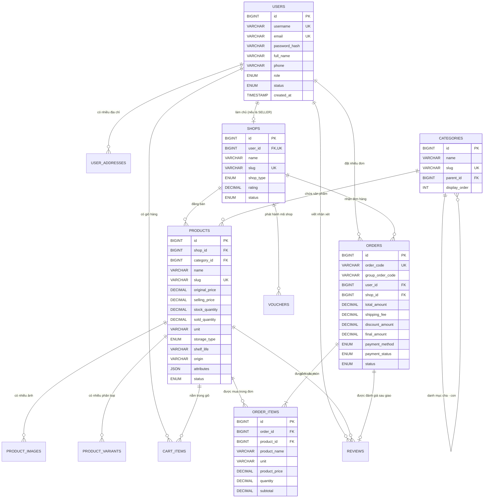

# 05. ĐẶC TẢ CƠ SỞ DỮ LIỆU & SƠ ĐỒ ERD (DATABASE SPECIFICATION)
## Database Schema, Data Dictionary & Entity Relationship Diagram

---

### 1. Sơ đồ Quan hệ Thực thể (Entity Relationship Diagram - ERD)


---

### 2. Từ điển Dữ liệu Chi tiết (Data Dictionary)

#### 2.1 Bảng `users` (Tài khoản người dùng)
| Tên cột | Kiểu dữ liệu | Nullable | Mặc định | Ý nghĩa & Mô tả |
| :--- | :--- | :---: | :---: | :--- |
| `id` | BIGINT AUTO_INCREMENT | NO | PK | Định danh người dùng |
| `username` | VARCHAR(50) | NO | UNIQUE | Tên đăng nhập duy nhất |
| `email` | VARCHAR(100) | NO | UNIQUE | Địa chỉ email liên hệ & nhận thông báo |
| `password_hash` | VARCHAR(255) | NO | | Mật khẩu đã được mã hóa bằng thuật toán BCrypt |
| `full_name` | VARCHAR(100) | NO | | Họ và tên đầy đủ |
| `phone` | VARCHAR(20) | YES | NULL | Số điện thoại di động |
| `avatar_url` | VARCHAR(255) | YES | NULL | Đường dẫn ảnh đại diện |
| `role` | ENUM | NO | `ROLE_BUYER` | Vai trò: `ROLE_BUYER`, `ROLE_SELLER`, `ROLE_ADMIN` |
| `status` | ENUM | NO | `ACTIVE` | Trạng thái: `ACTIVE` (Hoạt động), `BLOCKED` (Bị khóa) |
| `created_at` | TIMESTAMP | NO | CURRENT_TIMESTAMP | Ngày giờ khởi tạo tài khoản |

#### 2.2 Bảng `shops` (Gian hàng trên chợ)
| Tên cột | Kiểu dữ liệu | Nullable | Mặc định | Ý nghĩa & Mô tả |
| :--- | :--- | :---: | :---: | :--- |
| `id` | BIGINT AUTO_INCREMENT | NO | PK | Định danh gian hàng |
| `user_id` | BIGINT | NO | FK, UNIQUE | Chủ sở hữu shop (Quan hệ 1-1 với User có quyền SELLER) |
| `name` | VARCHAR(150) | NO | | Tên hiển thị của cửa hàng (VD: Nông Sản Đà Lạt) |
| `slug` | VARCHAR(150) | NO | UNIQUE | Đường dẫn thân thiện SEO (vd: `nong-san-da-lat`) |
| `shop_type` | ENUM | NO | `GENERAL` | Loại hình: `FOOD_FRESH` (Thực phẩm), `GENERAL`, `OFFICIAL_MALL` |
| `logo_url` | VARCHAR(255) | YES | NULL | Ảnh logo shop |
| `banner_url` | VARCHAR(255) | YES | NULL | Ảnh bìa gian hàng |
| `description` | TEXT | YES | NULL | Giới thiệu gian hàng |
| `phone` | VARCHAR(20) | YES | NULL | Số hotline hỗ trợ khách hàng của shop |
| `address` | VARCHAR(255) | YES | NULL | Địa chỉ kho/cửa hàng của người bán |
| `rating` | DECIMAL(2,1) | NO | 5.0 | Điểm đánh giá trung bình của shop (từ 1.0 - 5.0) |
| `status` | ENUM | NO | `APPROVED` | `PENDING` (Chờ duyệt), `APPROVED` (Đang bán), `LOCKED` (Khóa) |

#### 2.3 Bảng `products` (Sản phẩm Đa Ngành Hàng & Thực Phẩm)
| Tên cột | Kiểu dữ liệu | Nullable | Mặc định | Ý nghĩa & Mô tả |
| :--- | :--- | :---: | :---: | :--- |
| `id` | BIGINT AUTO_INCREMENT | NO | PK | Định danh sản phẩm |
| `shop_id` | BIGINT | NO | FK | Thuộc gian hàng nào |
| `category_id` | BIGINT | NO | FK | Thuộc danh mục ngành hàng nào |
| `name` | VARCHAR(255) | NO | | Tên mặt hàng (VD: Cà chua beef hữu cơ, Nồi chiên không dầu) |
| `slug` | VARCHAR(255) | NO | UNIQUE | Slug URL thân thiện SEO |
| `description` | TEXT | YES | NULL | Mô tả chi tiết sản phẩm |
| `thumbnail_url` | VARCHAR(255) | NO | | Ảnh đại diện chính của sản phẩm |
| `original_price` | DECIMAL(12,2) | NO | | Giá gốc (hiển thị gạch ngang) |
| `selling_price` | DECIMAL(12,2) | NO | | Giá bán thực tế hiện tại |
| `stock_quantity` | DECIMAL(10,2) | NO | 0.00 | Số lượng tồn kho (Hỗ trợ số lẻ như `25.5` kg) |
| `sold_quantity` | DECIMAL(10,2) | NO | 0.00 | Số lượng đã bán |
| `unit` | VARCHAR(30) | NO | `chiếc` | Đơn vị tính: `kg`, `g`, `bó`, `khay`, `lon`, `thùng`, `chiếc` |
| `min_order_quantity` | DECIMAL(10,2) | NO | 1.00 | Số lượng mua tối thiểu (vd: mua rau tối thiểu 0.5kg) |
| `step_quantity` | DECIMAL(10,2) | NO | 1.00 | Bước nhảy khi bấm tăng/giảm số lượng |
| `storage_type` | ENUM | NO | `NORMAL` | Bảo quản: `NORMAL` (Hàng khô), `FRESH` (Tươi sống), `FROZEN_CHILLED` (Đông lạnh/ngăn mát) |
| `shelf_life` | VARCHAR(100) | YES | NULL | Hạn sử dụng (VD: "3 ngày sau thu hoạch", "HSD: 12 tháng") |
| `origin` | VARCHAR(150) | YES | NULL | Nguồn gốc xuất xứ (VD: "Đà Lạt, Lâm Đồng", "Chính hãng Philips") |
| `attributes` | JSON | YES | NULL | Thuộc tính động dạng JSON (Xem mục 3) |
| `status` | ENUM | NO | `ACTIVE` | Trạng thái: `ACTIVE` (Đang bán), `INACTIVE` (Ẩn), `VIOLATION` (Vi phạm) |

---

### 3. Cấu trúc Thuộc tính Động JSON (`attributes`)
Trường `attributes` kiểu JSON trong bảng `products` cho phép lưu trữ thông tin linh hoạt mà không làm phình cấu trúc bảng:

* **Mặt hàng Thực phẩm & Nông sản tươi sống:**
  ```json
  {
    "certification": "VietGAP / OCOP 4 sao",
    "harvest_time": "Thu hoạch lúc 5h sáng",
    "preservation_guide": "Bảo quản ngăn mát 4-8 độ C",
    "is_organic": true
  }
  ```
* **Mặt hàng Nước uống & Đồ giải khát:**
  ```json
  {
    "volume": "330ml",
    "packaging": "Thùng 24 lon",
    "flavor": "Nguyên bản ít đường",
    "weight_grams": 8500
  }
  ```
* **Mặt hàng Đồ gia dụng & Điện tử:**
  ```json
  {
    "brand": "Philips",
    "model": "HD9252/90",
    "power": "1400W",
    "capacity": "4.1 Lít",
    "warranty_months": 24,
    "compatible_voltage": "220V"
  }
  ```
* **Mặt hàng Đồ công nghệ & Phụ kiện:**
  ```json
  {
    "brand": "Baseus",
    "fast_charge_standard": "Power Delivery 3.0 / Quick Charge 4.0",
    "max_output_power": "65W",
    "ports": ["2x Type-C", "1x USB-A"],
    "cable_length": "1.2m"
  }
  ```

---

### 4. Chiến lược Đánh Chỉ mục (Indexing Strategy)
Để tối ưu hóa hiệu năng truy vấn:
1. `products(category_id, status)`: Tối ưu bộ lọc sản phẩm theo danh mục và trạng thái đang bán.
2. `products(selling_price)`: Tối ưu sắp xếp theo khoảng giá.
3. `orders(user_id, status)`: Tối ưu tra cứu lịch sử đơn hàng của người mua.
4. `orders(shop_id, status)`: Tối ưu tra cứu đơn hàng của người bán trên Kênh Người Bán.
5. `orders(group_order_code)`: Tối ưu tra cứu và cập nhật trạng thái thanh toán theo nhóm đơn hàng.
