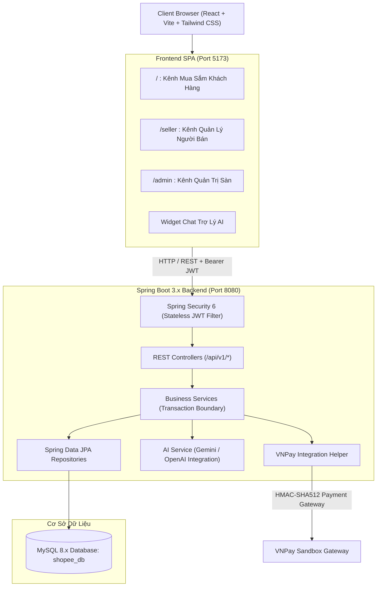

# Đặc tả Thiết kế Hệ thống Sàn Thương Mại Điện Tử Đa Ngành Hàng (Shopee Clone)

- **Ngày lập:** 2026-10-03
- **Trạng thái:** Đã phê duyệt (Approved)
- **Kiến trúc:** Modular Monolith (Spring Boot 3 + React Vite + MySQL 8)

---

## 1. Tổng quan & Mục tiêu Dự án

### 1.1 Mục tiêu
Xây dựng một nền tảng sàn thương mại điện tử đa người bán (Multi-vendor Marketplace) hoàn chỉnh, trực quan và hiện đại theo mô hình của Shopee. Hệ thống phục vụ mục đích đồ án tốt nghiệp / đồ án doanh nghiệp / sản phẩm mẫu chuẩn mực với đầy đủ các luồng nghiệp vụ từ người mua (Buyer), người bán (Seller), đến quản trị viên sàn (Admin).

### 1.2 Đặc thù Chợ Đa Ngành Hàng
Nền tảng đáp ứng danh mục sản phẩm đa dạng của một khu chợ đời thực và sàn TMĐT:
1. **Thực phẩm & Nông sản tươi sống:** Quản lý theo đơn vị tính (`kg`, `g`, `bó`, `khay`), số lượng lẻ (`0.5kg`), hạn sử dụng ngắn, nhiệt độ bảo quản (`FRESH`, `FROZEN`, `NORMAL`), xuất xứ và chứng nhận an toàn (VietGAP, OCOP).
2. **Nước uống & Đồ giải khát:** Quản lý theo quy cách đóng gói (`lon`, `chai`, `lốc 6`, `thùng 24`), dung tích (`ml`, `lít`), trọng lượng lớn và phí ship tương ứng.
3. **Đồ gia dụng & Nhà cửa đời sống:** Quản lý theo thông số công suất, thương hiệu, dung tích, thời gian bảo hành qua trường thuộc tính động `attributes` (JSON).
4. **Đồ công nghệ & Điện tử:** Quản lý thông số kỹ thuật, khả năng tương thích, bảo hành chính hãng.
5. **Thời trang & Tiêu dùng:** Phân loại size, màu sắc qua biến thể `product_variants`.

### 1.3 Trợ lý AI Toàn Năng (AI Shopping Copilot)
Tích hợp AI trợ lý mua sắm trực tiếp trên giao diện:
- Lên thực đơn, tính toán nguyên liệu nấu ăn và tự sinh danh sách sản phẩm.
- Tư vấn thông số kỹ thuật, so sánh thiết bị công nghệ và đồ gia dụng.
- Tìm kiếm sản phẩm theo ngân sách hoặc tiêu chí đặc thù (eat clean, ăn kiêng, tiệc liên hoan).
- Trả về câu trả lời tự nhiên kèm theo các thẻ sản phẩm trực quan có nút **"Thêm vào giỏ hàng"** tức thì.

---

## 2. Kiến trúc Hệ thống & Tech Stack



### 2.1 Backend (Spring Boot 3.x + Java 17)
- **Framework:** Spring Boot 3.3.x, Java 17 LTS.
- **ORM & Data:** Spring Data JPA, Hibernate, MySQL Connector/J.
- **Security:** Spring Security 6, JJWT (JSON Web Token) cho Stateless Authentication.
- **Validation:** Hibernate Validator (`@NotNull`, `@Size`, `@Min`, `@Pattern`).
- **Tài liệu API:** Springdoc OpenAPI (Swagger UI tại `/swagger-ui.html`).
- **Thanh toán:** Tích hợp VNPay Sandbox với mã hóa checksum HMAC-SHA512 và IPN Webhook.
- **AI Integration:** Spring AI / REST Client kết nối Gemini 1.5 / OpenAI API để xử lý prompt, nhận diện intent và map sản phẩm từ cơ sở dữ liệu.

### 2.2 Frontend (React + Vite + TypeScript)
- **Core:** React 18 / 19, TypeScript, Vite.
- **Giao diện & UI:** Tailwind CSS, Lucide Icons, Headless UI. Tone màu chủ đạo: Cam Shopee (`#EE4D2D`).
- **Routing:** React Router DOM v6/v7 với layout lồng nhau (Nested Layouts):
  - Kênh khách mua hàng (`/`)
  - Kênh người bán (`/seller/*`)
  - Kênh admin sàn (`/admin/*`)
- **State Management:** Zustand (quản lý `authStore` và `cartStore` bền vững qua LocalStorage).
- **HTTP Client:** Axios với Request/Response Interceptor xử lý Bearer Token và refresh lỗi 401/403.
- **Thông báo:** Sonner / React Hot Toast.

---

## 3. Thiết kế Cơ sở Dữ liệu Chi tiết (Database Schema)

Tất cả bảng đều dùng `InnoDB`, charset `utf8mb4`, collate `utf8mb4_unicode_ci`.

### 3.1 Bảng `users`
Lưu trữ toàn bộ người dùng của hệ thống (Khách hàng, Người bán, Admin).
```sql
CREATE TABLE users (
    id BIGINT AUTO_INCREMENT PRIMARY KEY,
    username VARCHAR(50) NOT NULL UNIQUE,
    email VARCHAR(100) NOT NULL UNIQUE,
    password_hash VARCHAR(255) NOT NULL,
    full_name VARCHAR(100) NOT NULL,
    phone VARCHAR(20),
    avatar_url VARCHAR(255),
    role ENUM('ROLE_BUYER', 'ROLE_SELLER', 'ROLE_ADMIN') NOT NULL DEFAULT 'ROLE_BUYER',
    status ENUM('ACTIVE', 'BLOCKED') NOT NULL DEFAULT 'ACTIVE',
    created_at TIMESTAMP DEFAULT CURRENT_TIMESTAMP,
    updated_at TIMESTAMP DEFAULT CURRENT_TIMESTAMP ON UPDATE CURRENT_TIMESTAMP
);
```

### 3.2 Bảng `user_addresses`
Sổ địa chỉ nhận hàng của người mua.
```sql
CREATE TABLE user_addresses (
    id BIGINT AUTO_INCREMENT PRIMARY KEY,
    user_id BIGINT NOT NULL,
    receiver_name VARCHAR(100) NOT NULL,
    phone VARCHAR(20) NOT NULL,
    province VARCHAR(100) NOT NULL,
    district VARCHAR(100) NOT NULL,
    ward VARCHAR(100) NOT NULL,
    detail_address VARCHAR(255) NOT NULL,
    is_default BOOLEAN DEFAULT FALSE,
    FOREIGN KEY (user_id) REFERENCES users(id) ON DELETE CASCADE
);
```

### 3.3 Bảng `shops`
Thông tin gian hàng của người bán (mỗi SELLER gắn với 1 Shop).
```sql
CREATE TABLE shops (
    id BIGINT AUTO_INCREMENT PRIMARY KEY,
    user_id BIGINT NOT NULL UNIQUE,
    name VARCHAR(150) NOT NULL,
    slug VARCHAR(150) NOT NULL UNIQUE,
    shop_type ENUM('FOOD_FRESH', 'GENERAL', 'OFFICIAL_MALL') NOT NULL DEFAULT 'GENERAL',
    logo_url VARCHAR(255),
    banner_url VARCHAR(255),
    description TEXT,
    phone VARCHAR(20),
    address VARCHAR(255),
    rating DECIMAL(2,1) DEFAULT 5.0,
    status ENUM('PENDING', 'APPROVED', 'REJECTED', 'LOCKED') NOT NULL DEFAULT 'APPROVED',
    created_at TIMESTAMP DEFAULT CURRENT_TIMESTAMP,
    FOREIGN KEY (user_id) REFERENCES users(id) ON DELETE CASCADE
);
```

### 3.4 Bảng `categories`
Danh mục ngành hàng đa cấp (Cha - Con).
```sql
CREATE TABLE categories (
    id BIGINT AUTO_INCREMENT PRIMARY KEY,
    name VARCHAR(100) NOT NULL,
    slug VARCHAR(100) NOT NULL UNIQUE,
    icon_url VARCHAR(255),
    parent_id BIGINT NULL,
    display_order INT DEFAULT 0,
    FOREIGN KEY (parent_id) REFERENCES categories(id) ON DELETE SET NULL
);
```

### 3.5 Bảng `products`
Sản phẩm đa ngành hàng, tích hợp các trường đặc thù cho thực phẩm, đồ uống và cột `attributes` JSON linh hoạt.
```sql
CREATE TABLE products (
    id BIGINT AUTO_INCREMENT PRIMARY KEY,
    shop_id BIGINT NOT NULL,
    category_id BIGINT NOT NULL,
    name VARCHAR(255) NOT NULL,
    slug VARCHAR(255) NOT NULL UNIQUE,
    description TEXT,
    thumbnail_url VARCHAR(255) NOT NULL,
    original_price DECIMAL(12,2) NOT NULL,
    selling_price DECIMAL(12,2) NOT NULL,
    stock_quantity DECIMAL(10,2) NOT NULL DEFAULT 0.00,
    sold_quantity DECIMAL(10,2) NOT NULL DEFAULT 0.00,
    
    -- Đặc thù Nông sản, Thực phẩm, Đồ uống:
    unit VARCHAR(30) NOT NULL DEFAULT 'chiếc', -- 'kg', 'g', 'bó', 'khay', 'lon', 'thùng', 'chiếc'
    min_order_quantity DECIMAL(10,2) NOT NULL DEFAULT 1.00,
    step_quantity DECIMAL(10,2) NOT NULL DEFAULT 1.00,
    storage_type ENUM('NORMAL', 'FRESH', 'FROZEN_CHILLED') NOT NULL DEFAULT 'NORMAL',
    shelf_life VARCHAR(100), -- '3 ngày sau thu hoạch', 'HSD 12 tháng'
    origin VARCHAR(150),     -- 'Đà Lạt, Lâm Đồng', 'Nhập khẩu New Zealand'
    
    -- Thuộc tính động không giới hạn (JSON):
    -- Ví dụ: {"power": "1800W", "capacity": "1.8L"} cho Gia dụng
    --        {"certification": "VietGAP", "harvest_hour": "05:00 AM"} cho Nông sản
    --        {"volume": "330ml", "pack": "Lốc 6 lon"} cho Đồ uống
    attributes JSON,
    
    rating_avg DECIMAL(2,1) DEFAULT 5.0,
    review_count INT DEFAULT 0,
    status ENUM('ACTIVE', 'INACTIVE', 'VIOLATION') NOT NULL DEFAULT 'ACTIVE',
    created_at TIMESTAMP DEFAULT CURRENT_TIMESTAMP,
    updated_at TIMESTAMP DEFAULT CURRENT_TIMESTAMP ON UPDATE CURRENT_TIMESTAMP,
    FOREIGN KEY (shop_id) REFERENCES shops(id) ON DELETE CASCADE,
    FOREIGN KEY (category_id) REFERENCES categories(id)
);
```

### 3.6 Bảng `product_images` & `product_variants`
```sql
CREATE TABLE product_images (
    id BIGINT AUTO_INCREMENT PRIMARY KEY,
    product_id BIGINT NOT NULL,
    image_url VARCHAR(255) NOT NULL,
    display_order INT DEFAULT 0,
    FOREIGN KEY (product_id) REFERENCES products(id) ON DELETE CASCADE
);

CREATE TABLE product_variants (
    id BIGINT AUTO_INCREMENT PRIMARY KEY,
    product_id BIGINT NOT NULL,
    variant_name VARCHAR(100) NOT NULL, -- 'Túi 500g', 'Thùng 24 lon', 'Màu Đen, Size XL'
    price DECIMAL(12,2) NOT NULL,
    stock_quantity DECIMAL(10,2) NOT NULL DEFAULT 0.00,
    FOREIGN KEY (product_id) REFERENCES products(id) ON DELETE CASCADE
);
```

### 3.7 Bảng `cart_items`
```sql
CREATE TABLE cart_items (
    id BIGINT AUTO_INCREMENT PRIMARY KEY,
    user_id BIGINT NOT NULL,
    product_id BIGINT NOT NULL,
    variant_id BIGINT NULL,
    quantity DECIMAL(10,2) NOT NULL DEFAULT 1.00,
    created_at TIMESTAMP DEFAULT CURRENT_TIMESTAMP,
    FOREIGN KEY (user_id) REFERENCES users(id) ON DELETE CASCADE,
    FOREIGN KEY (product_id) REFERENCES products(id) ON DELETE CASCADE,
    FOREIGN KEY (variant_id) REFERENCES product_variants(id) ON DELETE SET NULL
);
```

### 3.8 Bảng `orders` & `order_items` (Multi-Vendor Order Splitting)
```sql
CREATE TABLE orders (
    id BIGINT AUTO_INCREMENT PRIMARY KEY,
    order_code VARCHAR(50) NOT NULL UNIQUE,
    group_order_code VARCHAR(50) NOT NULL, -- Gom các đơn con cùng 1 lượt thanh toán
    user_id BIGINT NOT NULL,
    shop_id BIGINT NOT NULL,
    shipping_name VARCHAR(100) NOT NULL,
    shipping_phone VARCHAR(20) NOT NULL,
    shipping_address VARCHAR(255) NOT NULL,
    shipping_method ENUM('STANDARD', 'EXPRESS_FRESH') NOT NULL DEFAULT 'STANDARD',
    
    total_amount DECIMAL(12,2) NOT NULL,    -- Tiền hàng
    shipping_fee DECIMAL(12,2) NOT NULL,    -- Phí ship
    discount_amount DECIMAL(12,2) DEFAULT 0.00, -- Giảm giá voucher
    final_amount DECIMAL(12,2) NOT NULL,   -- Khách trả thực tế cho shop này
    
    payment_method ENUM('COD', 'VNPAY') NOT NULL DEFAULT 'COD',
    payment_status ENUM('UNPAID', 'PAID', 'REFUNDED') NOT NULL DEFAULT 'UNPAID',
    status ENUM('PENDING', 'CONFIRMED', 'SHIPPING', 'DELIVERED', 'CANCELLED') NOT NULL DEFAULT 'PENDING',
    note VARCHAR(255),
    created_at TIMESTAMP DEFAULT CURRENT_TIMESTAMP,
    updated_at TIMESTAMP DEFAULT CURRENT_TIMESTAMP ON UPDATE CURRENT_TIMESTAMP,
    FOREIGN KEY (user_id) REFERENCES users(id),
    FOREIGN KEY (shop_id) REFERENCES shops(id)
);

CREATE TABLE order_items (
    id BIGINT AUTO_INCREMENT PRIMARY KEY,
    order_id BIGINT NOT NULL,
    product_id BIGINT NOT NULL,
    variant_id BIGINT NULL,
    product_name VARCHAR(255) NOT NULL,
    unit VARCHAR(30) NOT NULL,
    product_price DECIMAL(12,2) NOT NULL,
    quantity DECIMAL(10,2) NOT NULL,
    subtotal DECIMAL(12,2) NOT NULL,
    FOREIGN KEY (order_id) REFERENCES orders(id) ON DELETE CASCADE,
    FOREIGN KEY (product_id) REFERENCES products(id)
);
```

### 3.9 Bảng `vouchers` & `payments` & `reviews`
```sql
CREATE TABLE vouchers (
    id BIGINT AUTO_INCREMENT PRIMARY KEY,
    code VARCHAR(50) NOT NULL UNIQUE,
    shop_id BIGINT NULL, -- NULL = Toàn sàn, có ID = Voucher của shop đó
    discount_type ENUM('PERCENT', 'FIXED_AMOUNT') NOT NULL,
    discount_value DECIMAL(12,2) NOT NULL,
    min_order_amount DECIMAL(12,2) NOT NULL DEFAULT 0.00,
    max_discount_amount DECIMAL(12,2) NULL,
    usage_limit INT DEFAULT 1000,
    used_count INT DEFAULT 0,
    start_date TIMESTAMP NOT NULL,
    end_date TIMESTAMP NOT NULL,
    FOREIGN KEY (shop_id) REFERENCES shops(id) ON DELETE CASCADE
);

CREATE TABLE payments (
    id BIGINT AUTO_INCREMENT PRIMARY KEY,
    group_order_code VARCHAR(50) NOT NULL,
    payment_gateway ENUM('COD', 'VNPAY') NOT NULL,
    transaction_no VARCHAR(100),
    amount DECIMAL(12,2) NOT NULL,
    status ENUM('PENDING', 'SUCCESS', 'FAILED') NOT NULL DEFAULT 'PENDING',
    pay_date TIMESTAMP DEFAULT CURRENT_TIMESTAMP
);

CREATE TABLE reviews (
    id BIGINT AUTO_INCREMENT PRIMARY KEY,
    product_id BIGINT NOT NULL,
    user_id BIGINT NOT NULL,
    order_item_id BIGINT NOT NULL,
    rating INT NOT NULL CHECK (rating BETWEEN 1 AND 5),
    comment TEXT,
    shop_reply TEXT,
    created_at TIMESTAMP DEFAULT CURRENT_TIMESTAMP,
    FOREIGN KEY (product_id) REFERENCES products(id) ON DELETE CASCADE,
    FOREIGN KEY (user_id) REFERENCES users(id),
    FOREIGN KEY (order_item_id) REFERENCES order_items(id)
);
```

---

## 4. Quy trình Luồng Nghiệp vụ Cốt lõi

### 4.1 Luồng Tách Đơn Hàng Đa Shop (Multi-Vendor Order Splitting)
1. Khách hàng bấm **"Tiến hành Đặt hàng"** từ Giỏ hàng.
2. Hệ thống nhóm các `cart_items` theo `product.shop_id`.
3. Tạo một `group_order_code` đại diện cho cả phiên thanh toán (VD: `GRP-20261003-9182`).
4. Với mỗi nhóm `shop_id`:
   - Tính tổng tiền hàng của shop.
   - Tính phí ship tương ứng (Ví dụ: `EXPRESS_FRESH` tính 30.000đ, `STANDARD` tính 15.000đ).
   - Áp dụng Voucher của shop (nếu có) và phân bổ tỷ lệ Voucher toàn sàn.
   - Tạo bản ghi `orders` riêng cho shop đó và danh sách các `order_items`.
5. Thực hiện trừ tồn kho nguyên tử (`stock_quantity -= quantity`).
6. Xóa các món đã mua khỏi `cart_items`.

### 4.2 Luồng Trừ Tồn Kho & Chống Xung Đột Concurrency
- Sử dụng Spring `@Transactional(isolation = Isolation.READ_COMMITTED)`.
- Khi cập nhật số lượng, câu lệnh SQL thực thi:
  ```sql
  UPDATE products 
  SET stock_quantity = stock_quantity - :qty, sold_quantity = sold_quantity + :qty 
  WHERE id = :productId AND stock_quantity >= :qty;
  ```
- Nếu số hàng cập nhật trả về = 0, ném `InsufficientStockException` để tự động Rollback toàn bộ giao dịch, đảm bảo không bao giờ bị âm kho.

### 4.3 Luồng Thanh toán VNPay Sandbox
1. Khi khách chọn phương thức `VNPAY`, backend lấy tổng tiền của `group_order_code`.
2. Tạo URL thanh toán VNPay có kèm tham số: `vnp_Amount`, `vnp_TxnRef = group_order_code`, `vnp_OrderInfo`, mã hóa HMAC-SHA512 với `vnp_HashSecret`.
3. Trả URL về cho Frontend chuyển hướng người dùng sang trang thanh toán VNPay.
4. Khi khách thanh toán xong:
   - **Kênh Webhook (IPN):** VNPay gọi trực tiếp `GET /api/v1/payment/vnpay/ipn`. Backend kiểm tra chữ ký SHA512, cập nhật `payment_status = 'PAID'` cho tất cả đơn hàng thuộc `group_order_code`.
   - **Kênh Trả về (Return URL):** Trình duyệt đưa khách về `/checkout/success?groupCode=...` hiển thị thông báo đặt hàng thành công.

### 4.4 Quy trình Tích hợp Trợ lý AI (AI Copilot)
1. Client gửi câu hỏi: `POST /api/v1/ai/chat` kèm nội dung hỏi (VD: *"Gợi ý nguyên liệu nấu canh chua cho 4 người"* hoặc *"Tìm giúp mình tai nghe bluetooth pin trâu dưới 500k"*).
2. Backend bóc tách từ khóa chính và ngữ cảnh (Category, Price range, Storage type).
3. Backend truy vấn MySQL lấy danh sách 5-8 sản phẩm phù hợp nhất đang còn hàng.
4. Xây dựng System Prompt kết hợp dữ liệu kho thực tế gửi sang AI:
   - *"Bạn là trợ lý thông minh của sàn Chợ Shopee. Hãy tư vấn cho người dùng dựa trên danh sách sản phẩm sau: [Danh sách sản phẩm từ DB]. Hãy giải thích thân thiện và trả về danh sách ID sản phẩm đề xuất dưới dạng JSON."*
5. AI sinh phản hồi dạng JSON có cấu trúc:
   ```json
   {
     "message": "Để nấu canh chua cá lóc thơm ngon cho 4 người, bạn nên chuẩn bị cá lóc tươi cùng các loại rau bổi tươi ngon từ nông sản Đà Lạt...",
     "suggestedProducts": [
       {"id": 12, "name": "Cá Lóc Đồng Làm Sạch 500g", "price": 65000, "thumbnailUrl": "..."},
       {"id": 15, "name": "Cà Chua Beef Hữu Cơ (Túi 500g)", "price": 18000, "thumbnailUrl": "..."},
       {"id": 22, "name": "Bạc Hà & Đậu Bắp Nấu Canh Chua (Khay)", "price": 12000, "thumbnailUrl": "..."}
     ]
   }
   ```
6. Frontend hiển thị đoạn chat và tự động gắn các Thẻ Sản Phẩm (Product Cards) trực tiếp trong khung chat có nút **"Thêm vào giỏ"**.

---

## 5. Danh mục RESTful API

### 5.1 Xác thực & Tài khoản (`/api/v1/auth`)
- `POST /api/v1/auth/register`: Đăng ký tài khoản (mặc định role `BUYER`).
- `POST /api/v1/auth/login`: Đăng nhập, trả về Bearer JWT Token và thông tin user.
- `GET /api/v1/auth/me`: Lấy thông tin user hiện tại từ token.
- `POST /api/v1/auth/register-seller`: Khách hàng đăng ký nâng cấp thành Người Bán (tạo Shop).

### 5.2 Danh mục & Khám phá Sản phẩm (`/api/v1/public`)
- `GET /api/v1/categories`: Lấy cây danh mục sản phẩm (Cha - Con).
- `GET /api/v1/products`: Tìm kiếm, lọc sản phẩm (hỗ trợ `search`, `categoryId`, `minPrice`, `maxPrice`, `storageType`, `unit`, `sort`, `page`, `limit`).
- `GET /api/v1/products/{id}`: Xem chi tiết sản phẩm, danh sách ảnh, thuộc tính JSON, thông tin shop và đánh giá.
- `GET /api/v1/shops/{id}`: Xem trang thông tin shop và các sản phẩm của shop đó.

### 5.3 Giỏ hàng & Đơn hàng (`/api/v1/buyer`)
- `GET /api/v1/cart`: Lấy giỏ hàng của user (đã tự động nhóm theo từng shop).
- `POST /api/v1/cart/items`: Thêm sản phẩm vào giỏ (xử lý số lượng lẻ như 0.5kg rau hoặc 1 lon nước).
- `PUT /api/v1/cart/items/{id}`: Cập nhật số lượng món trong giỏ.
- `DELETE /api/v1/cart/items/{id}`: Xóa món khỏi giỏ hàng.
- `POST /api/v1/orders/checkout-preview`: Tính toán trước tiền hàng, tiền ship, voucher cho từng shop.
- `POST /api/v1/orders`: Xác nhận đặt hàng (Tách đơn đa shop, trừ tồn kho).
- `GET /api/v1/orders`: Xem lịch sử đơn hàng của người mua (lọc theo trạng thái).
- `GET /api/v1/orders/{orderCode}`: Xem chi tiết đơn hàng con.
- `PUT /api/v1/orders/{orderCode}/cancel`: Hủy đơn khi đơn còn ở trạng thái `PENDING`.

### 5.4 Kênh Người Bán (`/api/v1/seller`) - Yêu cầu `ROLE_SELLER`
- `GET /api/v1/seller/dashboard`: Thống kê nhanh doanh thu, số đơn chờ xử lý, số sản phẩm sắp hết hàng.
- `GET /api/v1/seller/products`: Quản lý danh sách sản phẩm của shop.
- `POST /api/v1/seller/products`: Thêm mới sản phẩm (nhập tên, đơn vị tính, bảo quản, giá, JSON attributes).
- `PUT /api/v1/seller/products/{id}`: Sửa thông tin sản phẩm và cập nhật tồn kho.
- `DELETE /api/v1/seller/products/{id}`: Xóa hoặc chuyển trạng thái sản phẩm sang `INACTIVE`.
- `GET /api/v1/seller/orders`: Xem danh sách đơn hàng khách đặt tại shop mình.
- `PUT /api/v1/seller/orders/{orderCode}/status`: Cập nhật trạng thái đơn (`CONFIRMED` -> `SHIPPING` -> `DELIVERED`).

### 5.5 Quản trị Sàn (`/api/v1/admin`) - Yêu cầu `ROLE_ADMIN`
- `GET /api/v1/admin/dashboard`: Thống kê tổng số shop, tổng người dùng, tổng doanh thu toàn sàn.
- `GET /api/v1/admin/shops`: Danh sách các shop trên sàn (Duyệt hoặc Tạm khóa shop).
- `PUT /api/v1/admin/shops/{id}/status`: Duyệt đơn đăng ký mở shop (`APPROVED` / `REJECTED`).
- `GET /api/v1/admin/users`: Quản lý người dùng sàn (Khóa/Mở tài khoản).
- `POST /api/v1/admin/categories`: Thêm danh mục ngành hàng mới.

### 5.6 Thanh toán & Trợ lý AI (`/api/v1/payment`, `/api/v1/ai`)
- `POST /api/v1/payment/vnpay/create-payment`: Tạo URL thanh toán VNPay.
- `GET /api/v1/payment/vnpay/ipn`: Webhook nhận kết quả thanh toán từ VNPay.
- `POST /api/v1/ai/chat`: Nhận câu hỏi, tìm kiếm sản phẩm và trả lời thông minh kèm gợi ý sản phẩm.

---

## 6. Dữ liệu Mẫu (Data Seeding) Ban đầu

Hệ thống sẽ được nạp sẵn dữ liệu khởi tạo thông qua `DataInitializer` trong Spring Boot để sẵn sàng chạy và demo tức thì:

1. **5 Gian hàng mẫu:**
   - **Shop 1:** *Nông Sản Sạch Đà Lạt OCOP* (`FOOD_FRESH`) - Chuyên rau củ quả, cà chua beef, xà lách thủy canh, nấm đùi gà.
   - **Shop 2:** *Đại Lý Bia & Đồ Uống Hùng Phát* (`GENERAL`) - Chuyên thùng bia Tiger, lốc Coca-Cola, nước khoáng Lavie 19L, cà phê sữa đá đóng lon.
   - **Shop 3:** *Thế Giới Gia Dụng Philips & Sunhouse* (`OFFICIAL_MALL`) - Nồi chiên không dầu, ấm siêu tốc, máy xay sinh tố.
   - **Shop 4:** *Phụ Kiện Công Nghệ TechZone* (`GENERAL`) - Củ sạc nhanh 65W GaN, tai nghe Bluetooth True Wireless, cáp sạc Type-C bọc dù.
   - **Shop 5:** *Thời Trang Đời Sống UniStyle* (`GENERAL`) - Áo thun cotton trơn, túi tote đi chợ bảo vệ môi trường.

2. **Tài khoản kiểm thử dựng sẵn (Mật khẩu mặc định: `123456`):**
   - Quản trị viên: `admin` (`ROLE_ADMIN`)
   - Chủ shop thực phẩm: `seller_food` (`ROLE_SELLER`, Shop Nông Sản Đà Lạt)
   - Chủ shop đồ uống: `seller_drink` (`ROLE_SELLER`, Đại Lý Đồ Uống Hùng Phát)
   - Chủ shop gia dụng: `seller_gadget` (`ROLE_SELLER`, Shop Gia Dụng Philips)
   - Khách mua hàng: `buyer1` (`ROLE_BUYER`)

---

## 7. Kế hoạch Kiểm thử & Nghiệm thu (Verification Plan)

| Hạng mục kiểm thử | Kịch bản kiểm thử | Kết quả mong đợi |
| :--- | :--- | :--- |
| **Xác thực & Phân quyền** | Đăng nhập với các role Admin, Seller, Buyer | Chuyển hướng đúng layout route, chặn truy cập trái phép bằng 403 Forbidden |
| **Duyệt & Tìm kiếm Sản phẩm** | Lọc theo danh mục, đơn vị tính (`kg`/`thùng`), lọc giá | Kết quả hiển thị đúng, hiển thị nhãn bảo quản tươi sống, hạn sử dụng rõ ràng |
| **Giỏ hàng Đa Shop** | Thêm rau từ Shop 1, thùng nước từ Shop 2 vào cùng giỏ | Giỏ hàng tự gom nhóm theo từng shop, cho phép chọn số lượng lẻ (vd: 0.5kg) |
| **Tách đơn Checkout** | Đặt hàng giỏ có 2 shop khác nhau | Sinh ra 2 đơn hàng độc lập, mỗi shop thấy đúng đơn hàng của mình trong kênh Seller |
| **Trừ kho an toàn** | Đặt sản phẩm có tồn kho bằng số lượng yêu cầu | Tồn kho trừ chính xác, nếu đặt quá số tồn nhận lỗi thông báo thân thiện |
| **Thanh toán VNPay** | Chọn VNPay Sandbox, thực hiện thanh toán thẻ test | Webhook cập nhật đơn sang `PAID`, chuyển về trang thành công |
| **Trợ lý AI Copilot** | Nhắn: *"Gợi ý nguyên liệu nấu canh chua"* hoặc *"Tìm sạc nhanh 65W"* | AI trả lời tự nhiên + trả về đúng thẻ sản phẩm có nút thêm vào giỏ |
| **Kênh Người Bán** | Seller đăng nhập, thêm sản phẩm mới kèm ảnh & attributes | Sản phẩm xuất hiện ngay lập tức trên trang chủ chợ |
